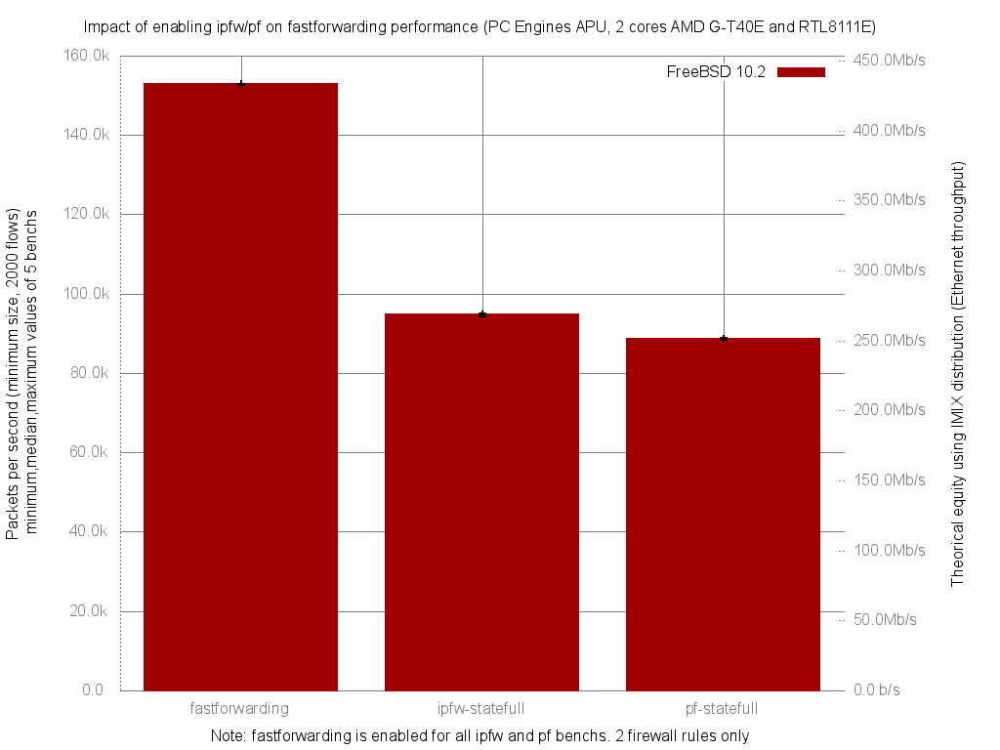

Impact of enabling ipfw/pf on fastforwarding performance
  - PC Engines APU (dual core AMD G-T40E Processor 1 GHz)
  - 3 Realtek RTL8111E Gigabit Ethernet ports
  - FreeBSD 10.2
  - 2000 flows of smallest UDP packets
  - Traffic load at 1.448Mpps (Gigabit line-rate)




```
x pps.fastforwarding
+ pps.ipfw-statefull
* pps.pf-statefull
+--------------------------------------------------------------------------+
|*      +                                                                 x|
|*      +                                                                 x|
|*      +                                                                 x|
|**     ++                                                                x|
|                                                                         A|
|       A                                                                  |
|A|                                                                        |
+--------------------------------------------------------------------------+
    N           Min           Max        Median           Avg        Stddev
x   5        152698        152852        152813      152781.4     65.854385
+   5         94324         95090         94818       94698.4     333.61849
Difference at 95.0% confidence
	-58083 +/- 350.691
	-38.0171% +/- 0.229538%
	(Student's t, pooled s = 240.456)
*   5         88457         88970         88687       88696.6     204.08405
Difference at 95.0% confidence
	-64084.8 +/- 221.153
	-41.9454% +/- 0.144751%
	(Student's t, pooled s = 151.636)
```
