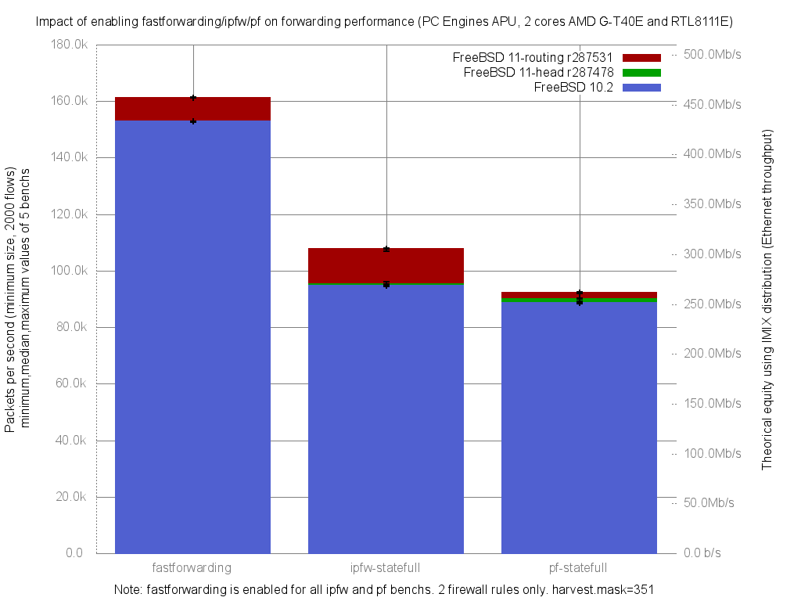

Impact of enabling ipfw/pf on fastforwarding performance
  - PC Engines APU (dual core AMD G-T40E Processor 1 GHz)
  - 3 Realtek RTL8111E Gigabit Ethernet ports
  - FreeBSD 11 routing.r287531
  - 2000 flows of smallest UDP packets
  - random.harvest.mask=351
  - Traffic load at 1.448Mpps (Gigabit line-rate)




```
x pps.fastforwarding
+ pps.ipfw-statefull
* pps.pf-statefull
+--------------------------------------------------------------------------+
|*                +                                                       x|
|**               +                                                       x|
|**              ++                                                       x|
|                                                                         A|
|                |A                                                        |
|A|                                                                        |
+--------------------------------------------------------------------------+
    N           Min           Max        Median           Avg        Stddev
x   5        161205        161460        161225        161280     105.29482
+   5        106957        107978        107756      107633.8     407.48031
Difference at 95.0% confidence
        -53646.2 +/- 434.027
        -33.2628% +/- 0.269114%
        (Student's t, pooled s = 297.596)
*   5         91817         92411         92078         92149     247.02935
Difference at 95.0% confidence
        -69131 +/- 276.932
        -42.864% +/- 0.171709%
        (Student's t, pooled s = 189.882)

```
