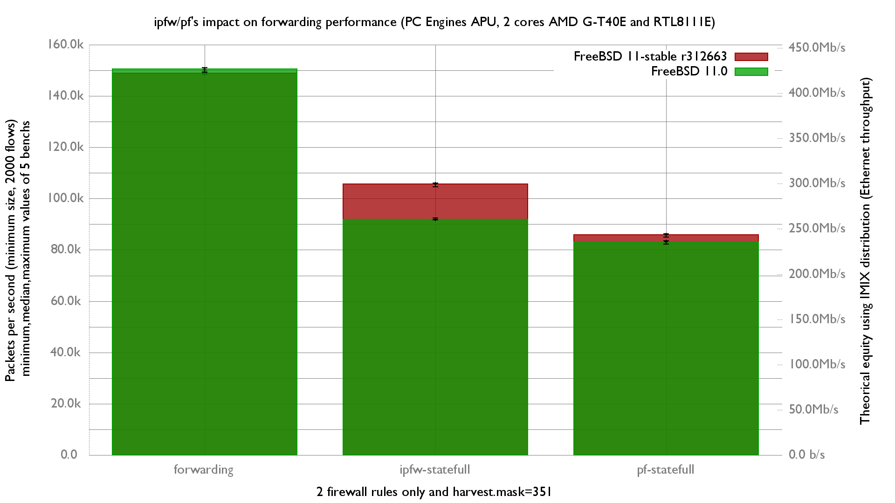

ipfw/pf's impact on forwarding performance on FreeBSD:
  - PC Engines APU (dual core AMD G-T40E Processor 1 GHz)
  - 3 Realtek RTL8111E Gigabit Ethernet ports
  - FreeBSD 11-stable r312663
  - 2000 flows of smallest UDP packets
  - Traffic load at 1.448Mpps (Gigabit line-rate)

