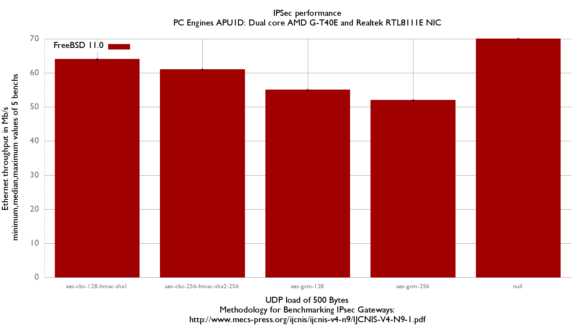

IPsec performance
  - PC Engines APU1D (core AMD G-T40E)
  - 3 Realtek RTL8111E NIC
  - FreeBSD 11.0
  - 2000 flows of UDP packets
  - 500B UDP load => packet size: 528B => Ethernet frame size:542B

