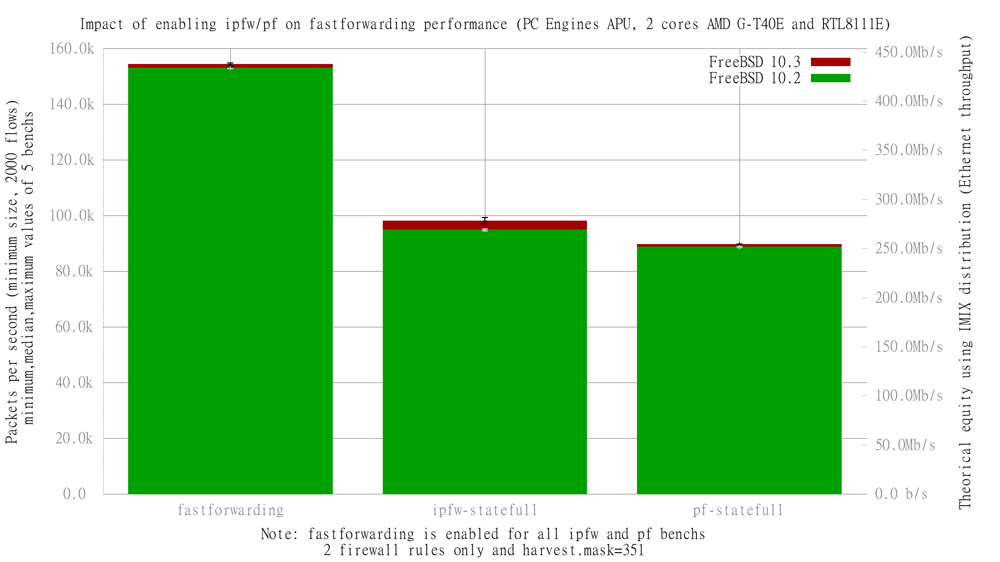

Impact of enabling ipfw/pf on fastforwarding performance
  - PC Engines APU (dual core AMD G-T40E Processor 1 GHz)
  - 3 Realtek RTL8111E Gigabit Ethernet ports
  - FreeBSD 10.3
  - 2000 flows of smallest UDP packets
  - Traffic load at 1.448Mpps (Gigabit line-rate)




```
x pps.forwarding
+ pps.fastforwarding
* pps.ipfw-statefull
% pps.pf-statefull
+--------------------------------------------------------------------------+
|%         *                                                               |
|%         *                                                               |
|%         *                x                                            + |
|%         *                x                                            ++|
|%%        *              x x                                            ++|
|%%       **              xxx                                            ++|
|%%       ***             xxx                                           +++|
|                          A|                                              |
|                                                                        A||
|         |A                                                               |
|A|                                                                        |
+--------------------------------------------------------------------------+
    N           Min           Max        Median           Avg        Stddev
x  10        111632        113561      112976.5      112811.1     690.33349
+  10        153367        154739      154160.5      154082.1     484.17363
Difference at 95.0% confidence
        41271 +/- 560.217
        36.5842% +/- 0.496597%
        (Student's t, pooled s = 596.232)
*  10         97039         99344         97924       97980.5     592.54765
Difference at 95.0% confidence
        -14830.6 +/- 604.443
        -13.1464% +/- 0.535801%
        (Student's t, pooled s = 643.301)
%  10         89211         89711         89514       89512.1     169.30804
Difference at 95.0% confidence
        -23299 +/- 472.246
        -20.6531% +/- 0.418617%
        (Student's t, pooled s = 502.606)
```
