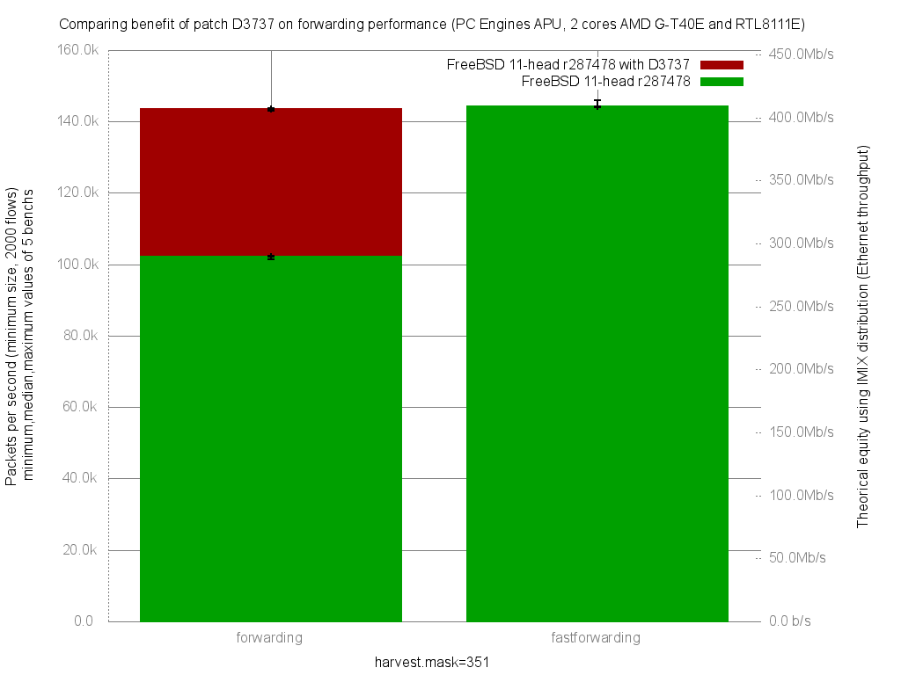

Comparing benefit of patch D3737 on forwarding performance
  - PC Engines APU (dual core AMD G-T40E Processor 1 GHz)
  - 3 Realtek RTL8111E Gigabit Ethernet ports
  - fbsd11-head.r287478 with D3737 patch
  - 2000 flows of smallest UDP packets
  - random.harvest.mask=351
  - Traffic load at 1.448Mpps (Gigabit line-rate)




```
x pps.forwarding (with D3737 patch)
+ ../fbsd11-head.r287478/pps.fastforwarding (without D3737 patch)
+--------------------------------------------------------------------------+
|x       x   xx     x   ++     +                        +                 +|
|   |______A_M_____|                                                       |
|                   |__________M__________A_____________________|          |
+--------------------------------------------------------------------------+
    N           Min           Max        Median           Avg        Stddev
x   5        143088        143810        143547      143486.6     268.72812
+   5        143960        145860        144240        144651     839.38847
Difference at 95.0% confidence
        1164.4 +/- 908.92
        0.811504% +/- 0.633453%
        (Student's t, pooled s = 623.213)
root@orange:~/netbenchs/AMD_G-T40E_2Cores_RTL8111E/fastforwarding-pf-ipfw/results/fbsd11-head.r287478-D37
```
