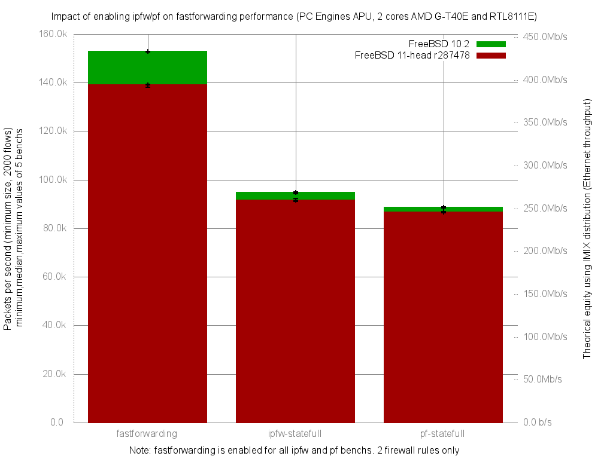

Impact of enabling ipfw/pf on fastforwarding performance
  - PC Engines APU (dual core AMD G-T40E Processor 1 GHz)
  - 3 Realtek RTL8111E Gigabit Ethernet ports
  - FreeBSD 11 head r287478
  - 2000 flows of smallest UDP packets
  - random.harvest.mask=351
  - Traffic load at 1.448Mpps (Gigabit line-rate)




```
x pps.fastforwarding
+ pps.ipfw-statefull
* pps.pf-statefull
+--------------------------------------------------------------------------+
|**      +                                                             x x |
|***     ++                                                            x xx|
|                                                                      |_A||
|        A                                                                 |
||A|                                                                       |
+--------------------------------------------------------------------------+
    N           Min           Max        Median           Avg        Stddev
x   5        143771        145812        145038      144750.8     895.37629
+   5         95145         95967         95312       95422.2     328.92355
Difference at 95.0% confidence
        -49328.6 +/- 983.713
        -34.0783% +/- 0.679591%
        (Student's t, pooled s = 674.496)
*   5         89188         90387         89980       89875.2     496.93631
Difference at 95.0% confidence
        -54875.6 +/- 1056.06
        -37.9104% +/- 0.729571%
        (Student's t, pooled s = 724.101)

```
