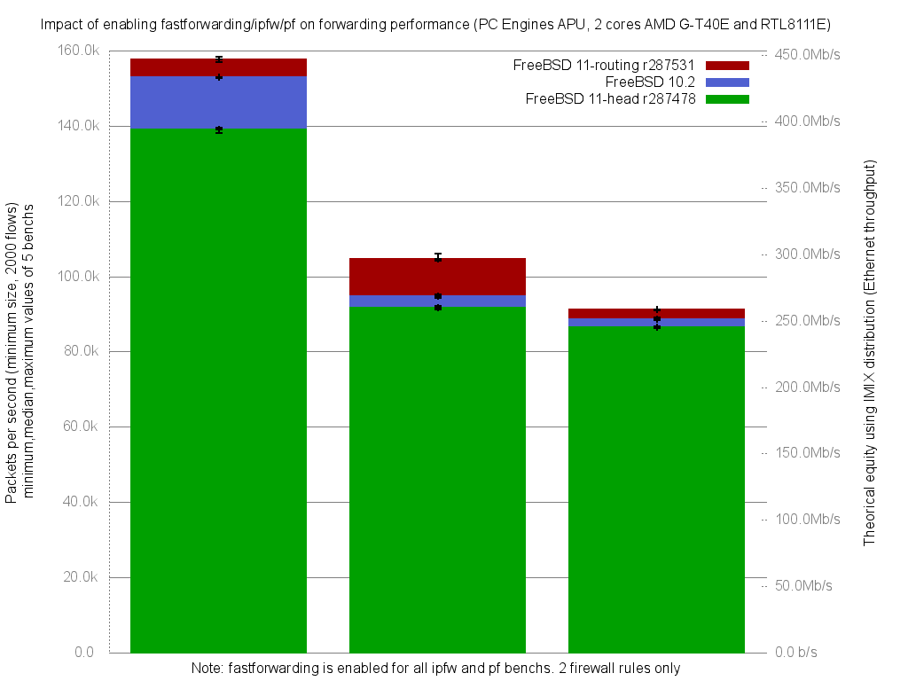

Impact of enabling ipfw/pf on fastforwarding performance
  - PC Engines APU (dual core AMD G-T40E Processor 1 GHz)
  - 3 Realtek RTL8111E Gigabit Ethernet ports
  - FreeBSD 11 routing.r287531
  - 2000 flows of smallest UDP packets
  - Traffic load at 1.448Mpps (Gigabit line-rate)




```
x pps.fastforwarding
+ pps.ipfw-statefull
* pps.pf-statefull
+--------------------------------------------------------------------------+
|*                                                                         |
|*                                                                         |
|*              +                                                          |
|*              +                                                        xx|
|*             +++                                                      xxx|
|                                                                        A||
|              |A|                                                         |
|A                                                                         |
+--------------------------------------------------------------------------+
    N           Min           Max        Median           Avg        Stddev
x   5        156895        158381        157747      157775.2     572.24313
+   5        104222        105949        104527        104826     673.14709
Difference at 95.0% confidence
	-52949.2 +/- 911.141
	-33.5599% +/- 0.577493%
	(Student's t, pooled s = 624.736)
*   5         90844         91248         91177       91087.2     171.40216
Difference at 95.0% confidence
	-66688 +/- 616.044
	-42.2677% +/- 0.390457%
	(Student's t, pooled s = 422.398)
```
