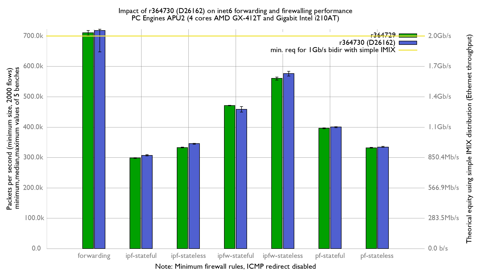

Impact of r364730 (D26162) on forwarding and firewalls:
  - PC Engines APU2C4 (quad core AMD GX-412T Processor 1 GHz)
  - 3 Intel i210AT Gigabit Ethernet ports
  - FreeBSD 12-stable r345325 (BSDRP 1.92)
  - 2000 flows of smallest UDP packets
  - Traffic load at 1.448Mpps (Gigabit line-rate)
  - net.inet.ip.redirect=0
  - net.inet6.ip6.redirect=0
  - txabdicate enabled

Major improvement on inet4 forwarding (+15%):
```
x r364729: inet4 packets-per-second forwarded
+ r364730: inet4 pps forwarded
+--------------------------------------------------------------------------+
|                                                                     +    |
|x                                    x x x           +             + + +  |
|          |__________________A________M__________|                        |
|                                                          |_______A__M___||
+--------------------------------------------------------------------------+
    N           Min           Max        Median           Avg        Stddev
x   4        561277        673073     665310.75     641242.88     53462.474
+   5        704916        754911        748684      740476.8     20232.861
Difference at 95.0% confidence
	99233.9 +/- 60596.5
	15.4752% +/- 10.6912%
	(Student's t, pooled s = 38195.3)
```





