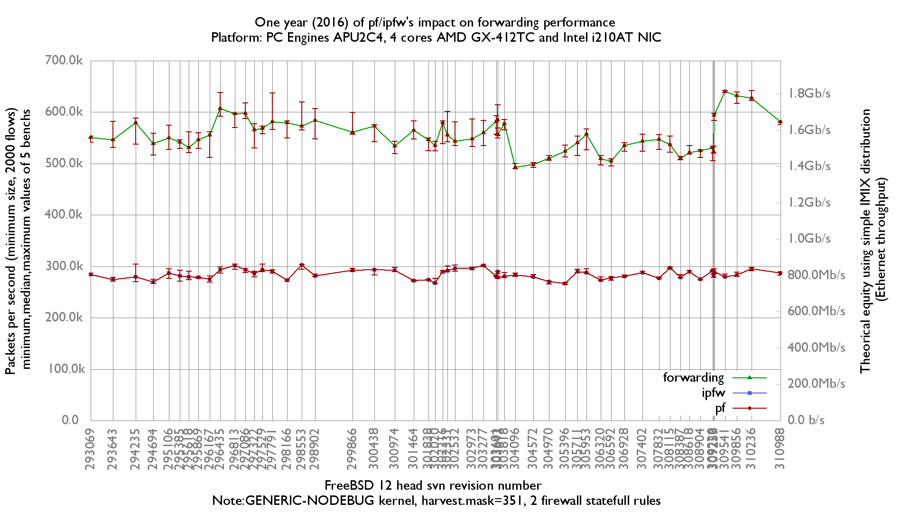

One year (2016) of ipfw/pf's impact on fastforwarding performance
  - PC Engines APU2C4 (quad core AMD GX-412T Processor 1 GHz)
  - 3 Intel i210AT Gigabit Ethernet ports
  - 2000 flows of smallest UDP packets
  - Traffic load at 1.448Mpps (Gigabit line-rate)

