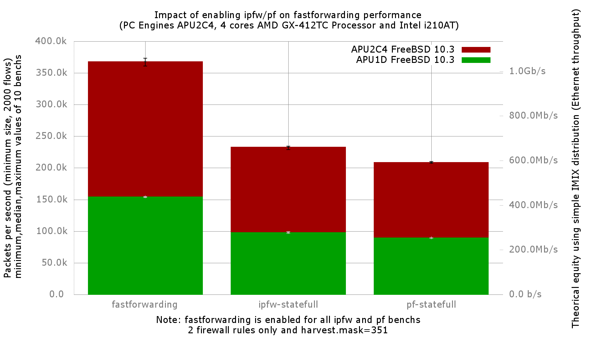

Impact of enabling ipfw/pf on fastforwarding performance
  - PC Engines APU2C4 (quad core AMD GX-412T Processor 1 GHz)
  - 3 Intel i210AT Gigabit Ethernet ports
  - FreeBSD 10.3
  - 2000 flows of smallest UDP packets
  - Traffic load at 1.448Mpps (Gigabit line-rate)




```
x fastforwarding.pps
+ ipfw-statefull.pps
* pf-statefull.pps
+--------------------------------------------------------------------------+
|*          +                                                              |
|*          +                                                              |
|*          +                                                              |
|*          +                                                        x     |
|**         +                                                        x     |
|**         +                                                        x  x x|
|**       ++++                                                       x xxxx|
|                                                                    |_AM| |
|          |A|                                                             |
|A|                                                                        |
+--------------------------------------------------------------------------+
    N           Min           Max        Median           Avg        Stddev
x  10        361105        373126        367820     366641.75     4723.0113
+  10        229056        234122     232831.75     232400.35     1501.7561
Difference at 95.0% confidence
        -134241 +/- 3292.75
        -36.6138% +/- 0.898084%
        (Student's t, pooled s = 3504.43)
*  10        207740        210328        208701      208738.7      686.9941
Difference at 95.0% confidence
        -157903 +/- 3170.96
        -43.0674% +/- 0.864867%
        (Student's t, pooled s = 3374.82)
```
