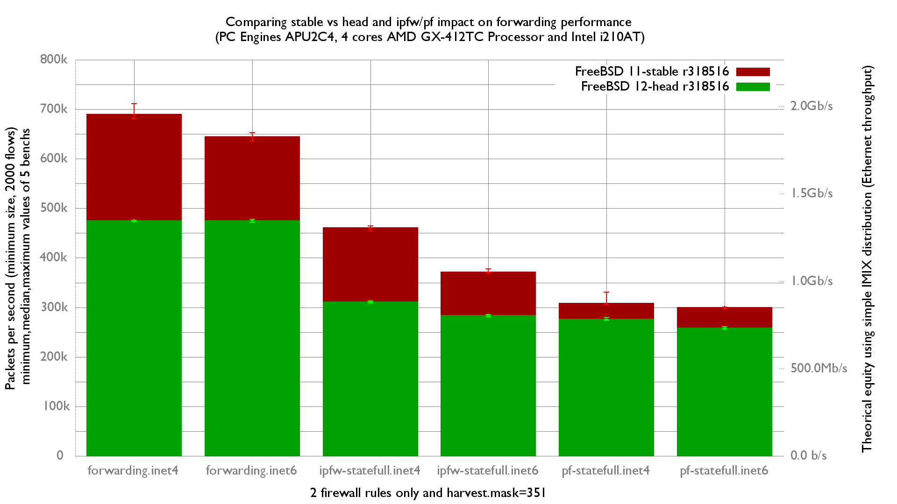

Comparing 12-head and 11-stable on forwarding/ipfw/pf performance
  - PC Engines APU2C4 (quad core AMD GX-412T Processor 1 GHz)
  - 3 Intel i210AT Gigabit Ethernet ports
  - FreeBSD r318516
  - 2000 flows of smallest UDP packets
  - Traffic load at 1.448Mpps (Gigabit line-rate)



There is a -30% performance drop for all tests: It's the new IFLIB drivers that is not well optimized.

inet4 forwarding performance is reduced (-31%):
```
x 318516stable.forwarding.inet4.pps
+ 318516current.forwarding.inet4.pps
+--------------------------------------------------------------------------+
|+                                                                         |
|++                                                                        |
|++                                                              xxx x    x|
|                                                                |_MA___|  |
|A|                                                                        |
+--------------------------------------------------------------------------+
    N           Min           Max        Median           Avg        Stddev
x   5        681208        710973        689737      692206.4     11661.571
+   5        473256        475632        474873      474442.2     1053.2821
Difference at 95.0% confidence
        -217764 +/- 12075.2
        -31.4594% +/- 1.20111%
        (Student's t, pooled s = 8279.54)

```
```
x 318516stable.forwarding.inet6.pps
+ 318516current.forwarding.inet6.pps
+--------------------------------------------------------------------------+
| +                                                                        |
| +                                                                        |
|+++                                                               x x x xx|
|                                                                   |__A_| |
||A|                                                                       |
+--------------------------------------------------------------------------+
    N           Min           Max        Median           Avg        Stddev
x   5      636314.5      652641.5        644112        644415     6923.5554
+   5      471560.5      477546.5      474624.5      474686.5     2139.9313
Difference at 95.0% confidence
        -169728 +/- 7473.36
        -26.3384% +/- 0.885103%
        (Student's t, pooled s = 5124.2)
```

Same drop regarding ipfw performance:

```
x 318516stable.ipfw-statefull.inet4.pps
+ 318516current.ipfw-statefull.inet4.pps
+--------------------------------------------------------------------------+
| +                                                                        |
| +                                                                        |
|+++                                                                 x xxxx|
|                                                                     |_A_||
||A|                                                                       |
+--------------------------------------------------------------------------+
    N           Min           Max        Median           Avg        Stddev
x   5        454230        464405        460697      460107.8     3984.9673
+   5        309273        312866        311377        311386     1383.8515
Difference at 95.0% confidence
        -148722 +/- 4350.34
        -32.3233% +/- 0.67941%
        (Student's t, pooled s = 2982.87)
```
```
x 318516stable.ipfw-statefull.inet6.pps
+ 318516current.ipfw-statefull.inet6.pps
+--------------------------------------------------------------------------+
|+ +                                                                x      |
|+ + +                                                              xx  x x|
|                                                                  |_MA__| |
||AM|                                                                      |
+--------------------------------------------------------------------------+
    N           Min           Max        Median           Avg        Stddev
x   5        369163        377687        371523      372533.3     3566.9129
+   5        281144      285922.5        283163      283078.1     1893.2628
Difference at 95.0% confidence
        -89455.2 +/- 4164.53
        -24.0127% +/- 0.915237%
        (Student's t, pooled s = 2855.46)
```
Impact is lower regarding pf (bottleneck more in pf than with the drivers?):

```
x 318516stable.pf-statefull.inet4.pps
+ 318516current.pf-statefull.inet4.pps
+--------------------------------------------------------------------------+
|++++   +                                 x x  x                          x|
|                                    |______M_____A_____________|          |
||_MA_|                                                                    |
+--------------------------------------------------------------------------+
    N           Min           Max        Median           Avg        Stddev
x   5        306091        330910        307848      312439.6     10409.691
+   5        274431        279499        275959      276153.8     2055.0841
Difference at 95.0% confidence
        -36285.8 +/- 10942.5
        -11.6137% +/- 3.11174%
        (Student's t, pooled s = 7502.83)
```
```
x 318516stable.pf-statefull.inet6.pps
+ 318516current.pf-statefull.inet6.pps
+--------------------------------------------------------------------------+
|  +                                                                 x    x|
|+ +  + +                                                            x  x x|
|                                                                    |_AM_||
||_MA__|                                                                   |
+--------------------------------------------------------------------------+
    N           Min           Max        Median           Avg        Stddev
x   5        297481      300703.5        299783      299203.4     1605.6393
+   5      256552.5      260780.5      257958.5      258492.4     1709.7868
Difference at 95.0% confidence
        -40711 +/- 2418.87
        -13.6065% +/- 0.758877%
        (Student's t, pooled s = 1658.53)
```

flame graph:
   - [r318516 12-head with inet4 forwarding](bench.318516current.forwarding.inet4.1.pmc.svg)
   - [r318516 12-head with inet6 forwarding](bench.318516current.forwarding.inet6.1.pmc.svg)
   - [r318516 12-head with inet4 ipfw-statefull](bench.318516current.ipfw-statefull.inet4.1.pmc.svg)
   - [r318516 12-head with inet6 ipfw-statefull](bench.318516current.ipfw-statefull.inet6.1.pmc.svg)
   - [r318516 12-head with inet4 pf-statefull](bench.318516current.pf-statefull.inet4.1.pmc.svg)
   - [r318516 12-head with inet6 pf-statefull](bench.318516current.pf-statefull.inet6.1.pmc.svg)
   - [r318516 11-stable with inet4 forwarding](bench.318516stable.forwarding.inet4.1.pmc.svg)
   - [r318516 11-stable with inet6 forwarding](bench.318516stable.forwarding.inet6.1.pmc.svg)
   - [r318516 11-stable with inet4 ipfw-statefull](bench.318516stable.ipfw-statefull.inet4.1.pmc.svg)
   - [r318516 11-stable with inet6 ipfw-statefull](bench.318516stable.ipfw-statefull.inet6.1.pmc.svg)
   - [r318516 11-stable with inet4 pf-statefull](bench.318516stable.pf-statefull.inet4.1.pmc.svg)
   - [r318516 11-stable with inet6 pf-statefull](bench.318516stable.pf-statefull.inet6.1.pmc.svg)

They were generated with this command (sched_idletd filtered):
```
stackcollapse-pmc.pl bench.312905.1.pmc.graph | grep -v sched_idletd | flamegraph.pl > bench.312905.svg

```
