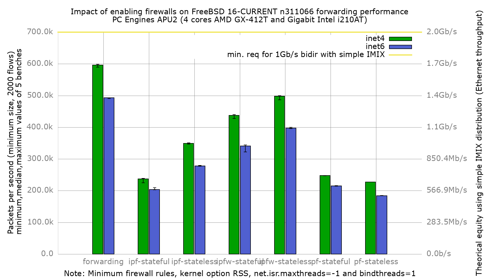

Impact of enabling firewalls on forwarding performance
  - PC Engines APU2C4 (quad core AMD GX-412T Processor 1 GHz)
  - 3 Intel i210AT Gigabit Ethernet ports
  - FreeBSD 16-CURRENT n311066
  - Kernel with `option RSS`
  - net.isr.maxthreads=-1 (one netisr workstream per CPU)
  - net.isr.bindthreads=1 (each workstream pinned to its CPU)
  - 2000 flows of smallest UDP packets
  - Traffic load at 1.448Mpps (Gigabit line-rate)
  - net.inet.ip.redirect=0
  - net.inet6.ip6.redirect=0
  - txabdicate enabled

Note on the net.isr tuning: a kernel built with `option RSS` forces netisr into
hybrid dispatch. With the default `net.isr.maxthreads=1`, a single netisr
workstream on CPU0 has to consume every RSS input bucket, so on this 4-core APU2
three cores stay idle and the IP input queue overflows (~96% of the min-size
traffic dropped as QDrops). Setting `net.isr.maxthreads=-1` creates one
workstream per CPU, the RSS distribution is honored end-to-end, and forwarding
throughput recovers about 10x. `net.isr.bindthreads=1` pins each workstream to
its CPU (throughput-neutral here, removes scheduler jitter). This is why the
result label carries the `option-RSS.net.isr` suffix: without this tuning the
same kernel forwards only ~56k pps.
