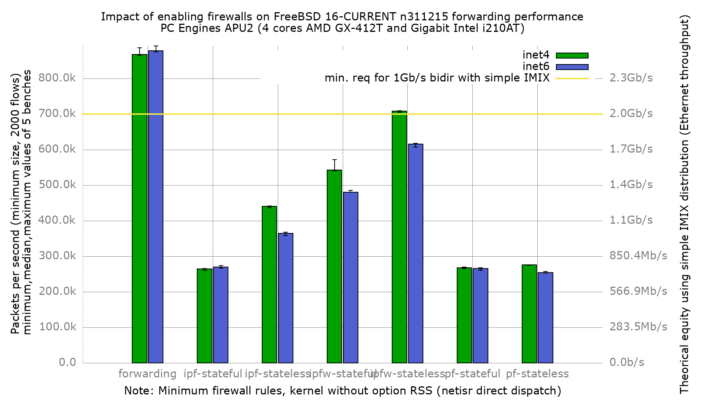
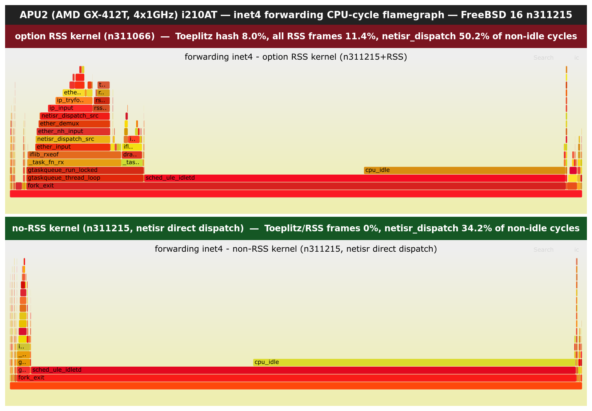

Impact of enabling firewalls on forwarding performance
  - PC Engines APU2C4 (quad core AMD GX-412T Processor 1 GHz)
  - 3 Intel i210AT Gigabit Ethernet ports
  - FreeBSD 16-CURRENT n311215
  - Kernel **without** `option RSS` (netisr uses direct dispatch)
  - 2000 flows of smallest UDP packets
  - Traffic load at 1.448Mpps (Gigabit line-rate)
  - net.inet.ip.redirect=0
  - net.inet6.ip6.redirect=0
  - txabdicate enabled

Note on RSS: this kernel is built without `option RSS`, so IP/IPv6 input runs
in netisr direct dispatch, processed on the same CPU that took the NIC
interrupt across all four i210AT queues. The `net.isr.maxthreads`/`bindthreads`
tuning that the [option-RSS run](../fbsd16-n311066.option-RSS.net.isr/README.md)
needed is inert here (`net.isr.dispatch: direct`), so it was left in the shared
config but has no effect.

## Comparison with the `option RSS` kernel (n311066)

Same hardware, same packet profile, same 5-iteration methodology. The only
difference is the kernel: n311066 with `option RSS` (+ net.isr.maxthreads=-1,
bindthreads=1) versus n311215 without `option RSS` (direct dispatch). Median
pps:

| Configuration    | inet4 no-RSS | inet4 RSS | inet4 delta | inet6 no-RSS | inet6 RSS | inet6 delta |
|------------------|-------------:|----------:|------------:|-------------:|----------:|------------:|
| forwarding       |      866969  |   595942  |      +45%   |      878173  |   492725  |      +78%   |
| ipf-stateful     |      264552  |   237002  |      +12%   |      269294  |   203740  |      +32%   |
| ipf-stateless    |      440099  |   349198  |      +26%   |      364660  |   277980  |      +31%   |
| ipfw-stateful    |      542704  |   437836  |      +24%   |      480034  |   341306  |      +41%   |
| ipfw-stateless   |      707853  |   497613  |      +42%   |      615383  |   397202  |      +55%   |
| pf-stateful      |      267505  |   247399  |       +8%   |      265822  |   214758  |      +24%   |
| pf-stateless     |      275468  |   227246  |      +21%   |      254331  |   184172  |      +38%   |

Removing `option RSS` improves throughput in every configuration and for both
address families on this 4-core APU2. The gain is largest for plain forwarding
(+45% inet4, +78% inet6) and for the lighter firewalls; it shrinks as the
per-packet firewall cost grows (stateful pf sees the least, +8% inet4). IPv6
benefits more than IPv4 across the board: the RSS run carried a persistent
~15-20% IPv6 penalty relative to IPv4, which direct dispatch erases — forwarding
inet6 (878k) now slightly exceeds inet4 (867k).

The mechanism: on a 1 GHz 4-core APU2 the RSS software-hash and hybrid-dispatch
hand-off cost more than they buy. With RSS the flow is NIC RSS bucket -> netisr
workstream -> IP input; even tuned to one workstream per CPU, the extra queueing
and re-dispatch add per-packet overhead the direct path avoids. Higher-core
hardware may trade differently, but for this platform a kernel without
`option RSS` is the faster forwarding/firewalling configuration.

## PMC / flamegraph proof

To confirm the delta comes from the netisr/RSS path and not elsewhere, a
system-mode CPU-cycle profile (`pmcstat -S k8-bu-cpu-clk-unhalted`) was captured
on each kernel during a 1.45 Mpps inet4 forwarding blast, on identical hardware
and packet profile. Same event, same config-set; only the kernel differs.

Individual interactive flamegraphs:
[option RSS](pmc/forwarding.option-RSS.svg) ·
[no-RSS](pmc/forwarding.no-RSS.svg).

Share of non-idle CPU cycles spent in each frame:

| frame | option RSS | no-RSS |
|-------|-----------:|-------:|
| `toeplitz_hash` (RSS software hash) | 8.0% | 0.0% |
| all RSS frames (`rss_*`)            | 11.4% | 0.0% |
| `netisr_dispatch_src`               | 50.2% | 34.2% |
| `ip_input`                          | 30.4% | 29.1% |
| `ip_tryforward`                     | 25.4% | 27.3% |
| `iflib_rxeof`                       | 62.5% | 52.3% |

The discriminator is unambiguous. The RSS kernel spends 11.4% of all non-idle
cycles in RSS code (8.0% in `toeplitz_hash` alone) and carries a heavier netisr
dispatch (50.2% vs 34.2%). On the no-RSS kernel those RSS frames are **entirely
absent** — the path is compiled out — while the pure per-packet forwarding work
(`ip_input`, `ip_tryforward`) is nearly identical between the two. That is the
mechanism behind the forwarding gain: removing `option RSS` deletes the software
Toeplitz hash and thins the netisr dispatch hand-off; nothing else in the
forwarding path changed.
