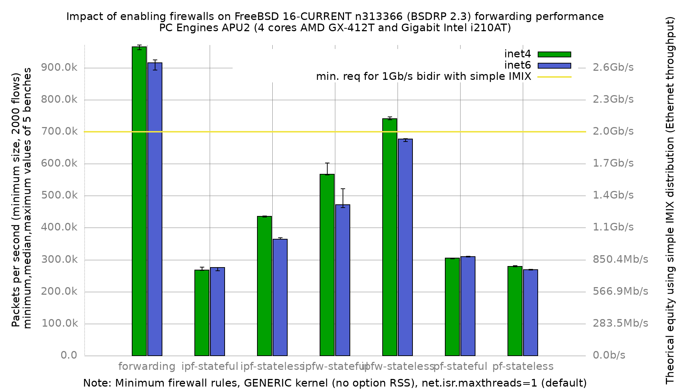

Impact of enabling firewalls on forwarding performance
  - PC Engines APU2C4 (quad core AMD GX-412T Processor 1 GHz)
  - 3 Intel i210AT Gigabit Ethernet ports
  - FreeBSD 16-CURRENT n313366 (BSDRP 2.3)
  - GENERIC kernel
  - 2000 flows of smallest UDP packets
  - Traffic load at 1.489Mpps inet4 / 1.453Mpps inet6 (Gigabit line-rate)
  - 5 iterations per data point, reboot between each

Median values (pps):

| configuration  | inet4  | inet6  |
|----------------|--------|--------|
| forwarding     | 965776 | 915611 |
| ipf-stateful   | 268170 | 275307 |
| ipf-stateless  | 435643 | 364259 |
| ipfw-stateful  | 566841 | 471844 |
| ipfw-stateless | 740992 | 676658 |
| pf-stateful    | 304591 | 309438 |
| pf-stateless   | 278955 | 268687 |

Observations:

ipfw is the fastest of the three firewalls in both modes: stateless 741k pps
(23% below plain forwarding), stateful 567k. ipf is the slowest in stateful
mode (268k, a 72% drop from plain forwarding), and pf sits between the two.

pf is the one firewall here where enabling state *increases* throughput
(305k stateful vs 279k stateless on inet4). This is not a measurement
artifact: both sets have a spread under 1.2%. It is also not a standing
property of pf on this platform. The directly comparable predecessor
`fbsd16-n311215` (same GENERIC no-RSS kernel, same config-sets) is *not*
inverted: 267505 stateful vs 275468 stateless. Across the archive the
inversion appears in some runs (`fbsd16-n311066.option-RSS.net.isr`,
`fbsd12-stable.r354440.BSDRP.1.96`) and not others (`fbsd16-n311215`,
`fbsd13-c255632`).

What changed between n311215 and n313366 is that pf-stateful improved by
13.9% (inet4) and 16.4% (inet6) while pf-stateless moved only +1.3% / +5.6%.
The inversion in this run is that gain crossing over stateless, not a fixed
pf characteristic. pf-stateful is the largest firewall-side improvement in
the version delta below.

Version delta against `fbsd16-n311215` (same GENERIC no-RSS kernel,
net.isr defaults, 2000 flows, Gigabit line-rate offered load):

| configuration  | n311215 inet4 | n313366 inet4 | delta  | n311215 inet6 | n313366 inet6 | delta  |
|----------------|---------------|---------------|--------|---------------|---------------|--------|
| forwarding     | 866969        | 965776        | +11.4% | 878173        | 915611        | +4.3%  |
| ipf-stateful   | 264552        | 268170        | +1.4%  | 269294        | 275307        | +2.2%  |
| ipf-stateless  | 440099        | 435643        | -1.0%  | 364660        | 364259        | -0.1%  |
| ipfw-stateful  | 542704        | 566841        | +4.4%  | 480034        | 471844        | -1.7%  |
| ipfw-stateless | 707853        | 740992        | +4.7%  | 615383        | 676658        | +10.0% |
| pf-stateful    | 267505        | 304591        | +13.9% | 265822        | 309438        | +16.4% |
| pf-stateless   | 275468        | 278955        | +1.3%  | 254331        | 268687        | +5.6%  |

Caveat on the +11.4% plain-forwarding gain: n311215 predates the e1000 UDP
RSS hashtype fix (D58513), which moved forwarded UDP egress from a single TX
queue to all four on this hardware. Part of the forwarding delta above may be
that fix rather than generic n311215-to-n313366 improvement. Not isolated
here.

For ipf and pf in stateful mode the inet6 result equals or slightly exceeds
inet4, because state lookup dominates and the larger IPv6 header stops being
the limiting factor. Where the firewall is cheaper (plain forwarding,
ipf-stateless, ipfw-*) inet6 costs 5 to 16% relative to inet4.

## CPU profiling (hwpmc / flamegraph)

Profiled each configuration with `hwpmc` while forwarding IPv4 60 B frames
(event `BU_CPU_CLK_UNHALTED`, the AMD GX-412T cycle counter), rendered as
flamegraphs under [`PMC/`](PMC/) together with the folded call graphs.

| configuration  | offered | non-idle samples | cycles in firewall | top frame           | flamegraph |
|----------------|---------|------------------|--------------------|---------------------|------------|
| forwarding     | 300 Kpps | 625494          | 0.0%               | -                   | [svg](PMC/forwarding.svg) |
| ipf-stateful   | 150 Kpps | 950904          | 53.1%              | `ipf_check`         | [svg](PMC/ipf-stateful.svg) |
| ipf-stateless  | 300 Kpps | 1273247         | 35.5%              | `ipf_check`         | [svg](PMC/ipf-stateless.svg) |
| ipfw-stateful  | 300 Kpps | 1001204         | 25.9%              | `ipfw_chk`          | [svg](PMC/ipfw-stateful.svg) |
| ipfw-stateless | 300 Kpps | 796537          | 15.7%              | `ipfw_chk`          | [svg](PMC/ipfw-stateless.svg) |
| pf-stateful    | 150 Kpps | 918387          | 51.2%              | `pf_test`           | [svg](PMC/pf-stateful.svg) |
| pf-stateless   | 150 Kpps | 1078255         | 56.0%              | `pf_test`           | [svg](PMC/pf-stateless.svg) |

"cycles in firewall" is the share of non-idle samples whose stack passes
through `pfil_*`, `ipf_check`, `ipfw_chk`/`ipfw_check_packet` or `pf_test`.
The `forwarding` set measuring exactly 0.0% is the control: no firewall is
loaded, so no such frame can appear.

### Read the percentages within a rate group only

The offered rate differs per configuration, so the firewall shares are **not**
comparable across the two groups. Per-packet firewall work is a larger
fraction of a lighter total load, so 53.1% at 150 Kpps does not mean ipf is
more expensive than ipfw at 25.9% / 300 Kpps. Within a group the comparison
holds: at 300 Kpps, ipfw-stateless 15.7% < ipfw-stateful 25.9% <
ipf-stateless 35.5%, matching the throughput ranking measured independently.

The profiles do confirm the pf state behavior described above, at one rate and
therefore comparably: **pf-stateless spends 56.0% of non-idle cycles in
`pf_test` against pf-stateful's 51.2%**, both at 150 Kpps. The `no state`
ruleset is evaluated in full for every packet, while a stateful match
short-circuits on the state table — which is the mechanism behind
pf-stateful's higher throughput.

### Capture note

A full-rate capture is not usable on this hardware. At gigabit line rate the
4-core APU2 pins every core in the RX/forward path, userland `pmcstat` starves
and hwpmc overflows its per-CPU buffers: a `PMC=true ... -P` run with
`PMC_DURATION=50` returned **96.5% idle, 7918 non-idle samples of 226896** and
`pmcstat: WARNING: at least 2325567 events were discarded`. The window had
landed on the blast (the forwarding path was on top) — the problem is
saturation, not window placement.

All profiles here were therefore taken sub-saturation with `pkt-gen -R`, with
`pmcstat` driven mid-blast once the rate was steady. The rate is chosen per
configuration against that configuration's own ceiling: 300 Kpps for the sets
whose median exceeds 430 Kpps, 150 Kpps for ipf-stateful (268 Kpps median),
pf-stateful (305 Kpps) and pf-stateless (279 Kpps) — at a flat 300 Kpps those
three saturated, the receiver trailed the sender by 4-21%, and the `pmcstat`
SSH died with `Connection timed out during banner exchange`. Every capture
retained here has receiver pps equal to offered pps (no DUT loss).

Cycle *proportions* are rate-independent, which is what the flamegraphs
diagnose. The limitation is that a sub-saturation profile cannot show
saturation-only effects such as lock contention that appears only once queues
back up.

ipfw-stateful is the only noisy data point: iterations cluster into two groups
(~565k and ~600k on inet4, ~465k and ~520k on inet6), giving a 6.5% inet4 and
12.7% inet6 spread against under 1.5% for most other sets. The min/max bars in
the graph show it. Cause not investigated.

Note on comparing with `fbsd16-n311066.option-RSS.net.isr`: that result set
used a kernel built with `option RSS` plus net.isr.maxthreads=-1, so a
difference against it mixes two variables (kernel option and netisr tuning)
and is not a clean n311066-to-n313366 version delta. This run uses the GENERIC
no-RSS kernel, verified with `sysctl -n kern.conftxt | grep -i 'options.*RSS'`
returning no match; with no `option RSS` the netisr hybrid-dispatch collapse
does not apply and the default maxthreads=1 is safe (netstat -Q shows QDrops
at 0).
