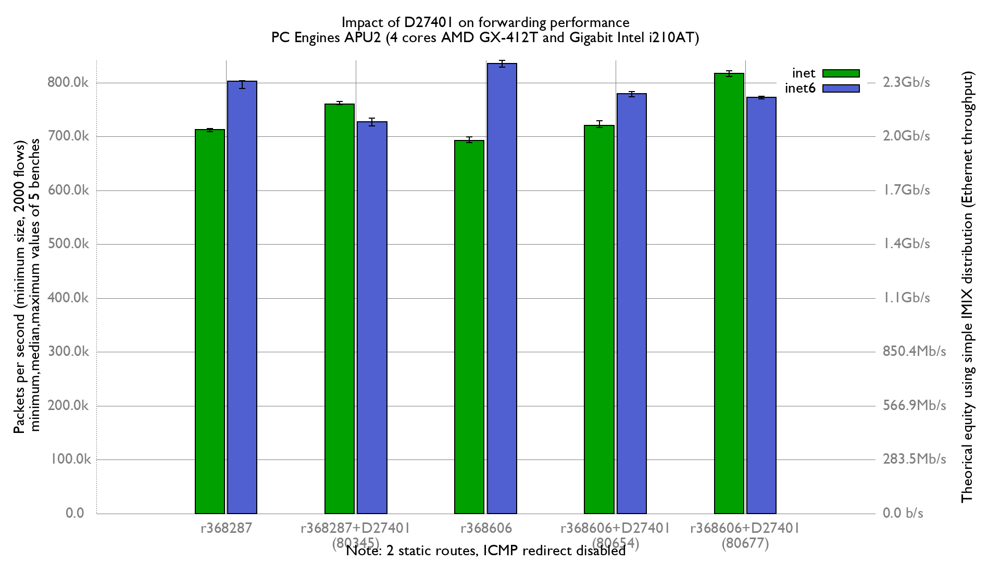

Comparing D27401 (Diff 80677) impact on forwarding performance:
  - PC Engines APU2C4 (quad core AMD GX-412T Processor 1 GHz)
  - 3 Intel i210AT Gigabit Ethernet ports
  - 2000 flows of smallest UDP packets
  - Traffic load at 1.448Mpps (Gigabit line-rate)
  - 2 static routes
  - net.inet.ip.redirect=0
  - net.inet6.ip6.redirect=0
  - txabdicate enabled



IPv4:
```
x r368287: inet packets-per-second forwarded
+ r368287 with D27401(diff 80345): inet packets-per-second forwarded
* r368606: inet packets-per-second forwarded
% r368606 with D27401(diff 80654): inet packets-per-second forwarded
# r368606 with D27401(diff 80677): inet packets-per-second forwarded
+--------------------------------------------------------------------------+
|* **  *    xxxx%%%    %               +++ +                        ## # ##|
|            |A|                                                           |
|                                      |MA|                                |
||_MA_|                                                                    |
|               |_MA_|                                                     |
|                                                                    |_A_| |
+--------------------------------------------------------------------------+
    N           Min           Max        Median           Avg        Stddev
x   5        709354        714432      713233.5      712422.6     1982.8937
+   5        758958        765088        760400      761040.8     2462.0839
Difference at 95.0% confidence
	48618.2 +/- 3260.15
	6.82435% +/- 0.470149%
	(Student's t, pooled s = 2235.37)
*   5        689027        699309        692963      693623.6     3737.6421
Difference at 95.0% confidence
	-18799 +/- 4363.38
	-2.63874% +/- 0.608958%
	(Student's t, pooled s = 2991.81)
%   5        717070        729076        720408      720972.8     4823.3116
Difference at 95.0% confidence
	8550.2 +/- 5378.09
	1.20016% +/- 0.756219%
	(Student's t, pooled s = 3687.56)
#   5        811681        821825        817063      816675.1      4227.013
Difference at 95.0% confidence
	104252 +/- 4815.01
	14.6335% +/- 0.694745%
	(Student's t, pooled s = 3301.48)
```

IPv6:

```
x r368287: inet6 packets-per-second forwarded
+ r368287 with D27401(diff 80345): inet6 packets-per-second forwarded
* r368606: inet6 packets-per-second forwarded
% r368606 with D27401(diff 80654): inet6 packets-per-second forwarded
# r368606 with D27401(diff 80677): inet6 packets-per-second forwarded
+--------------------------------------------------------------------------+
|                              #  #  %                                 *   |
|+  ++  ++                     # ##  % %  x    x   x              **   *  *|
|                                            |__A__M|                      |
| |__MA__|                                                                 |
|                                                                  |__AM_| |
|                                 |_AM|                                    |
|                              |AM|                                        |
+--------------------------------------------------------------------------+
    N           Min           Max        Median           Avg        Stddev
x   5        788906        803551        802206      798778.5     6343.1769
+   5      719992.5        733702        727297        727664     5500.2861
Difference at 95.0% confidence
	-71114.5 +/- 8658.35
	-8.90291% +/- 1.02997%
	(Student's t, pooled s = 5936.71)
*   5        828258        841220        835708      834153.3     5350.7916
Difference at 95.0% confidence
	35374.8 +/- 8558.14
	4.42861% +/- 1.09937%
	(Student's t, pooled s = 5868)
%   5        773629        783357        779245      778150.4     3979.1216
Difference at 95.0% confidence
	-20628.1 +/- 7722.13
	-2.58246% +/- 0.948893%
	(Student's t, pooled s = 5294.78)
#   5        769584        774446        772878        772183     2354.6964
Difference at 95.0% confidence
	-26595.5 +/- 6977.74
	-3.32952% +/- 0.848041%
	(Student's t, pooled s = 4784.37)
```
