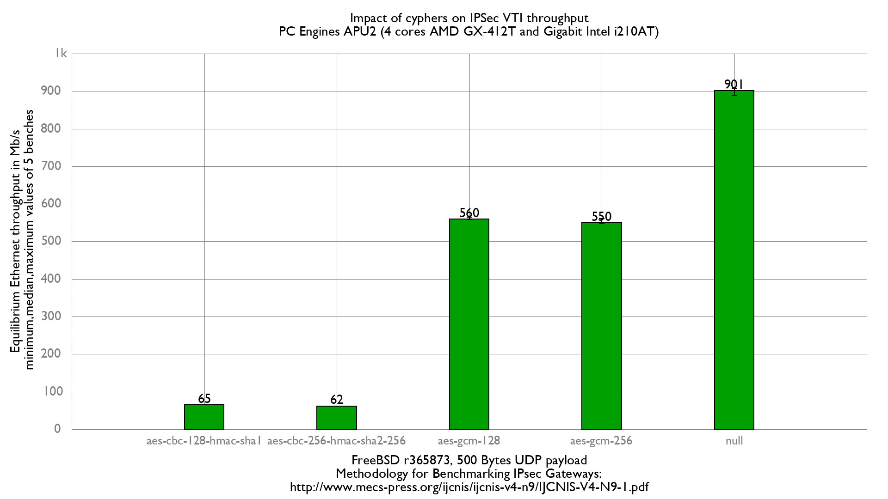

Impact of cyphers on IPsec (VTI mode) performance
  - PC Engines APU2C4 (quad core AMD GX-412T Processor 1 GHz)
  - 3 Intel i210AT Gigabit Ethernet ports
  - FreeBSD 13-head r365873
  - 5000 flows of clear UDP packets
  - dev.igb.*.iflib.tx_abdicate=1
  - 500Bytes UDP load => packet size: 528B => Ethernet frame size:542B



Difference with standard mode:
```
x null cypher, standard mode: Mb/s
+ null cypher, VTI mode: Mb/s
+--------------------------------------------------------------------------+
|xx                                                                    +   |
|xx                                                              +     ++ +|
|A|                                                                        |
|                                                                  |___A__||
+--------------------------------------------------------------------------+
    N           Min           Max        Median           Avg        Stddev
x   5           763           765           763         763.6    0.89442719
+   5           889           906           901         899.8     6.4575537
Difference at 95.0% confidence
	136.2 +/- 6.72309
	17.8366% +/- 0.88366%
	(Student's t, pooled s = 4.60977)
```

```
x aes-gcm-128 cypher, standard mode: Mb/s
+ aes-gcm-128 cypher, VTI mode: Mb/s
+--------------------------------------------------------------------------+
|   x                                                               ++     |
| x x      x      x                                                 ++    +|
||__M___A_____|                                                            |
|                                                                   |MA_|  |
+--------------------------------------------------------------------------+
    N           Min           Max        Median           Avg        Stddev
x   5           487           504           489         493.2     7.1554175
+   5           559           565           560         560.6     2.5099801
Difference at 95.0% confidence
	67.4 +/- 7.82003
	13.6659% +/- 1.7798%
	(Student's t, pooled s = 5.3619)
```
