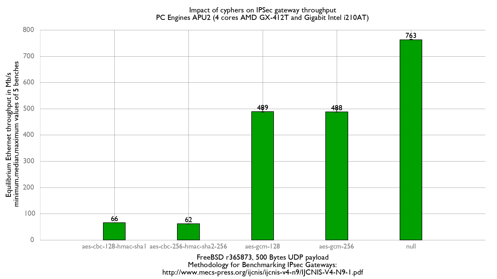

Impact of cyphers on IPsec performance
  - PC Engines APU2C4 (quad core AMD GX-412T Processor 1 GHz)
  - 3 Intel i210AT Gigabit Ethernet ports
  - FreeBSD 13-head r365873
  - 4 SAD/SPD (2 IPv4, 2 IPv6)
  - 5000 flows of clear UDP packets
  - dev.igb.*.iflib.tx_abdicate=1
  - 500Bytes UDP load => packet size: 528B => Ethernet frame size:542B

