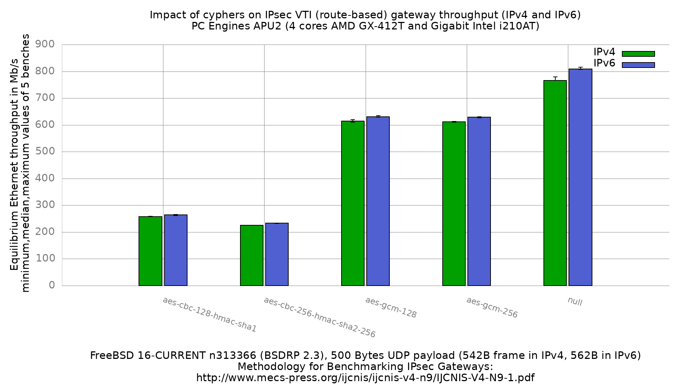

Impact of cyphers on IPsec VTI (route-based) performance (IPv4 and IPv6)
  - PC Engines APU2 (quad core AMD GX-412TC 1 GHz), DUT = apu2-3
  - 3 Intel i210AT Gigabit Ethernet ports
  - FreeBSD 16-CURRENT n313366 (BSDRP 2.3)
  - AES-NI enabled (`aesni0: <AES-CBC,AES-CCM,AES-GCM,AES-ICM,AES-XTS>`)
  - **VTI (route-based)**: `if_ipsec(4)` interface, reqid 100 on the DUT and
    200 on the peer, SAs bound to it with `-u`, no SPD entry
  - 4 SAs per cypher (2 IPv4, 2 IPv6), tunnel mode
  - 5000 flows of clear UDP packets
  - dev.igb.*.iflib.tx_abdicate=1
  - 500Bytes UDP load => 542B Ethernet frame in IPv4, 562B in IPv6



```
cypher                       IPv4   IPv6
aes-cbc-128-hmac-sha1         258    264
aes-cbc-256-hmac-sha2-256     226    233
aes-gcm-128                   614    631
aes-gcm-256                   612    629
null                          766    809
```

Values are Mb/s, median of 5 benches.

## Why this result set exists

The [policy-based result set](../fbsd16-n313366.BSDRP.2.3/README.md) of this
same image configures IPsec with `spdadd` policies and no tunnel interface.
The OpenVPN DCO and WireGuard benches of this machine both route into a kernel
interface (`if_ovpn(4)`, `if_wg(4)`). Comparing them with policy-based IPsec
compares two different things: an SPD match in the forwarding path against a
route into a virtual interface.

This run uses `if_ipsec(4)` so that all three VPNs on this machine can be
compared on the same kind of datapath. It is the same DUT, the same generator,
the same image and the same cyphers as the policy-based run; only the
configuration mode differs.

## VTI against policy-based, same image and same cyphers

```
cypher                      pol v4  VTI v4  gain   pol v6  VTI v6  gain
null                           732     766    5%      590     809   37%
aes-gcm-128                    550     614   12%      458     631   38%
aes-gcm-256                    547     612   12%      458     629   37%
aes-cbc-128-hmac-sha1          247     258    4%      231     264   14%
aes-cbc-256-hmac-sha2-256      217     226    4%      204     233   14%
```

VTI is faster in every case, but the IPv6 column is where the difference is
large, and the reason is not that VTI is fast on IPv6. It is that the
policy-based path is slow on IPv6 and VTI is not.

## The IPv6 penalty is a property of the policy-based path

Converting both result sets to packets per second removes the frame-size
difference (542B in IPv4, 562B in IPv6) and makes the effect obvious:

```
                             policy-based              VTI
cypher                      v4 kpps v6 kpps v6/v4   v4 kpps v6 kpps v6/v4
null                          168.8   131.2  0.78     176.7   179.9  1.02
aes-gcm-128                   126.8   101.9  0.80     141.6   140.3  0.99
aes-gcm-256                   126.2   101.9  0.81     141.1   139.9  0.99
aes-cbc-128-hmac-sha1          57.0    51.4  0.90      59.5    58.7  0.99
aes-cbc-256-hmac-sha2-256      50.0    45.4  0.91      52.1    51.8  0.99
```

In policy-based mode IPv6 costs 9 to 22% of the packet rate. In VTI mode it
costs nothing measurable: every ratio is 0.99 to 1.02, which is the same
packet rate within the noise of this bench.

So the 37-38% "VTI gain" in the IPv6 Mb/s column is mostly the policy-based
penalty being absent, plus the 3.7% that the larger IPv6 frame adds to any
Mb/s figure at constant packet rate.

The natural suspect is the SPD lookup: in policy-based mode every forwarded
packet is matched against the policy database, and the IPv6 selectors here are
two `/49` prefixes. This has **not** been profiled, so it stays a suspicion.
What the bench establishes is the size and the location of the cost, not its
cause.

## The IPv4 gains are smaller and do not order by cypher cost

The IPv4 column ranges from 4% to 12%, and it is not monotonic in how
expensive the cypher is:

```
cypher                      v4 gain   VTI v4 kpps gained over policy
aes-cbc-256-hmac-sha2-256        4%                             2.1
aes-cbc-128-hmac-sha1            4%                             2.5
null                             5%                            10.8
aes-gcm-256                     12%                            15.0
aes-gcm-128                     12%                            15.5
```

A simple "the forwarding path is a fixed cost per packet, so it matters more
when the crypto is cheap" model predicts that `null`, which does no crypto at
all, gains the most. It does not: it gains 5%, against 12% for the AES-GCM
pair, and in absolute packet rate it gains fewer packets per second than they
do. `null` and `aes-cbc-256` sit at the same relative gain despite a threefold
difference in throughput.

Whatever VTI does for the AES-GCM path on IPv4 is therefore specific to it and
is not explained by this bench. Reporting it as measured.

## Comparison with the other interface-based VPNs

Same DUT, same image, same method, IPv4, all three routing into a kernel
interface:

```
VPN          cypher                 Mb/s    kpps
OpenVPN DCO  null                    900   207.6
IPsec VTI    null                    766   176.7
IPsec VTI    aes-gcm-128             614   141.6
IPsec VTI    aes-gcm-256             612   141.1
WireGuard    chacha20-poly1305       413    95.2
OpenVPN DCO  aes-gcm-128             365    84.2
OpenVPN DCO  aes-gcm-256             351    81.0
IPsec VTI    aes-cbc-128-hmac-sha1   258    59.5
IPsec VTI    aes-cbc-256-hmac-sha256 226    52.1
```

OpenVPN DCO has the fastest forwarding path of the three (900 Mb/s on the null
cypher, against 766 for VTI) and the slowest AES-GCM (365 against 614). Those
two facts belong together: `if_ovpn(4)` moves packets well, and on this CPU its
AES-GCM costs much more per packet than the one IPsec drives through
`aesni(4)`. A single ranking of the three VPNs would hide that.

([WireGuard](../../../wireguard/results/fbsd16-n313366.BSDRP.2.3/README.md),
[OpenVPN DCO](../../../openvpn/results/fbsd16-n313366.BSDRP.2.3/README.md),
[policy-based IPsec](../fbsd16-n313366.BSDRP.2.3/README.md).)

## Raw data

`RAW/` holds the per-iteration equilibrium output, `bench.inet4.*` and
`bench.inet6.*`. The `*.inet4.equilibrium` / `*.inet6.equilibrium` files are
the 5 equilibrium values per cypher and address family, `*.equilibrium.max`
the maximum value seen during each search. `gnuplot.data[.max]` is their
ministat aggregation, and `inet4.data` / `inet6.data` are the per-family split
used to draw the grouped histogram.
