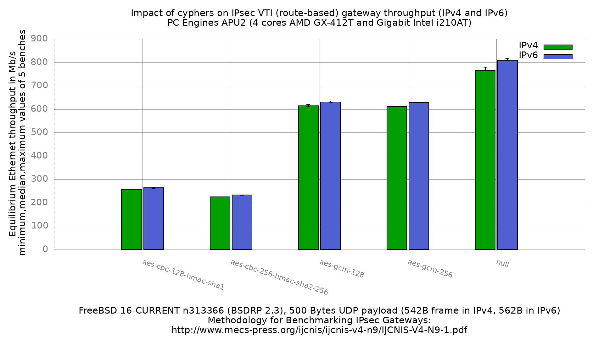

Impact of cyphers on IPsec VTI (route-based) performance
  - PC Engines APU2 (quad core AMD GX-412TC 1 GHz), DUT = apu2-3
  - 3 Intel i210AT Gigabit Ethernet ports
  - FreeBSD 16-CURRENT n313366 (BSDRP 2.3)
  - AES-NI enabled (`aesni0: <AES-CBC,AES-CCM,AES-GCM,AES-ICM,AES-XTS>`)
  - **VTI (route-based)**: `if_ipsec(4)` interface, reqid 100 on the DUT and
    200 on the peer, SAs bound to it with `-u`, no SPD entry
  - 4 SAs per cypher (2 IPv4, 2 IPv6), tunnel mode, but **only the IPv4 pair
    ever carried traffic**: see the correction below
  - 5000 flows of clear UDP packets
  - dev.igb.*.iflib.tx_abdicate=1
  - 500Bytes UDP load => 542B Ethernet frame in IPv4, 562B in IPv6

> **Correction (2026-09-29).** The IPv6 column of this set is not an IPv6
> IPsec measurement, and the IPv6 comparison against the policy-based set is
> invalid. `if_ipsec(4)` carries one outer endpoint pair per interface and the
> config set it to IPv4, so the arm labelled IPv6 sent IPv6 *inner* packets
> through an IPv4 ESP tunnel. The policy-based set it is compared against
> **does** tunnel IPv6 over IPv6. The affected section is replaced below. The
> IPv4 comparison is unaffected and stands as measured.



```
                             IPv4   "IPv6"
cypher                     tunnel   inner-only
aes-cbc-128-hmac-sha1         258    264
aes-cbc-256-hmac-sha2-256     226    233
aes-gcm-128                   614    631
aes-gcm-256                   612    629
null                          766    809
```

Values are Mb/s, median of 5 benches. **The second column is not IPv6 IPsec**:
both columns ran the same IPv4 ESP tunnel and differ only in the address
family of the packets carried inside it.

## Why this result set exists

The [policy-based result set](../fbsd16-n313366.BSDRP.2.3/README.md) of this
same image configures IPsec with `spdadd` policies and no tunnel interface.
The OpenVPN DCO and WireGuard benches of this machine both route into a kernel
interface (`if_ovpn(4)`, `if_wg(4)`). Comparing them with policy-based IPsec
compares two different things: an SPD match in the forwarding path against a
route into a virtual interface.

This run uses `if_ipsec(4)` so that all three VPNs on this machine can be
compared on the same kind of datapath. It is the same DUT, the same generator,
the same image and the same cyphers as the policy-based run; only the
configuration mode differs.

## VTI against policy-based, same image and same cyphers

```
cypher                      pol v4  VTI v4  gain
null                           732     766    5%
aes-gcm-128                    550     614   12%
aes-gcm-256                    547     612   12%
aes-cbc-128-hmac-sha1          247     258    4%
aes-cbc-256-hmac-sha2-256      217     226    4%
```

VTI is faster in every IPv4 case. **The IPv6 columns have been removed from
this comparison**: the two sets did not run the same tunnel there, so the
difference measured something other than VTI against policy-based. See the
next section.

## Withdrawn: "the IPv6 penalty is a property of the policy-based path"

This section previously reported that policy-based IPsec pays a 9-22%
packet-rate penalty on IPv6 while VTI pays none, and named the SPD lookup as
the natural suspect. **The comparison was invalid and the section is
withdrawn.**

The two sets did not tunnel IPv6 the same way:

  - The **policy-based** set tunnels IPv6 over IPv6. Its `ipsec.conf` carries
    `spdadd 2001:2::/49 2001:2:0:8000::/49 any -P out ipsec
    esp/tunnel/2001:2:0:1::205-2001:2:0:1::203/require`, so the outer header
    is IPv6.
  - The **VTI** set tunnels everything over IPv4. `if_ipsec(4)` carries one
    outer endpoint pair per interface, and the config sets it to IPv4:
    `ifconfig_ipsec0="inet 198.18.2.205/24 198.18.2.203 tunnel 198.18.1.205
    198.18.1.203"`. The `ifconfig_ipsec0_ipv6` line adds an *inner* address,
    not a second outer, which is what made the set look dual-stack.

So the IPv6 rows compared a real IPv6 ESP tunnel against an IPv4 ESP tunnel
carrying IPv6 inner packets. The gap conflates the datapath mode under test
with a difference in outer address family, and this bench cannot separate the
two. Nothing here supports or refutes an SPD-lookup cost on IPv6.

The ratio table is kept because it shows the signature clearly, but read the
VTI column as "IPv6 inner over an IPv4 tunnel":

```
                             policy-based              VTI
                           (v6 over v6)          (v6 inner, v4 tunnel)
cypher                      v4 kpps v6 kpps v6/v4   v4 kpps v6 kpps v6/v4
null                          168.8   131.2  0.78     176.7   179.9  1.02
aes-gcm-128                   126.8   101.9  0.80     141.6   140.3  0.99
aes-gcm-256                   126.2   101.9  0.81     141.1   139.9  0.99
aes-cbc-128-hmac-sha1          57.0    51.4  0.90      59.5    58.7  0.99
aes-cbc-256-hmac-sha2-256      50.0    45.4  0.91      52.1    51.8  0.99
```

The VTI column's 0.99 to 1.02 is now the expected result rather than a
finding: with one shared IPv4 tunnel the number of ESP operations does not
change with the inner address family, so the packet rate cannot either, and
the whole Mb/s difference is the 20 extra header bytes. The policy-based
column's 0.78 to 0.91 is a real IPv6-over-IPv6 cost, but it has no valid
comparator in this set.

This same misconfiguration affects the Atom C2758 IPsec VTI sets; see
[`../../../../Atom_C2758_8Cores/Chelsio_T540-CR/ipsec/results/fbsd16-n313366.BSDRP.2.3/README.md`](../../../../Atom_C2758_8Cores/Chelsio_T540-CR/ipsec/results/fbsd16-n313366.BSDRP.2.3/README.md).

## The IPv4 gains are smaller and do not order by cypher cost

The IPv4 column ranges from 4% to 12%, and it is not monotonic in how
expensive the cypher is:

```
cypher                      v4 gain   VTI v4 kpps gained over policy
aes-cbc-256-hmac-sha2-256        4%                             2.1
aes-cbc-128-hmac-sha1            4%                             2.5
null                             5%                            10.8
aes-gcm-256                     12%                            15.0
aes-gcm-128                     12%                            15.5
```

A simple "the forwarding path is a fixed cost per packet, so it matters more
when the crypto is cheap" model predicts that `null`, which does no crypto at
all, gains the most. It does not: it gains 5%, against 12% for the AES-GCM
pair, and in absolute packet rate it gains fewer packets per second than they
do. `null` and `aes-cbc-256` sit at the same relative gain despite a threefold
difference in throughput.

Whatever VTI does for the AES-GCM path on IPv4 is therefore specific to it and
is not explained by this bench. Reporting it as measured.

## Comparison with the other interface-based VPNs

Same DUT, same image, same method, IPv4, all three routing into a kernel
interface:

```
VPN          cypher                 Mb/s    kpps
OpenVPN DCO  null                    900   207.6
IPsec VTI    null                    766   176.7
IPsec VTI    aes-gcm-128             614   141.6
IPsec VTI    aes-gcm-256             612   141.1
WireGuard    chacha20-poly1305       413    95.2
OpenVPN DCO  aes-gcm-128             365    84.2
OpenVPN DCO  aes-gcm-256             351    81.0
IPsec VTI    aes-cbc-128-hmac-sha1   258    59.5
IPsec VTI    aes-cbc-256-hmac-sha256 226    52.1
```

OpenVPN DCO has the fastest forwarding path of the three (900 Mb/s on the null
cypher, against 766 for VTI) and the slowest AES-GCM (365 against 614). Those
two facts belong together: `if_ovpn(4)` moves packets well, and on this CPU its
AES-GCM costs much more per packet than the one IPsec drives through
`aesni(4)`. A single ranking of the three VPNs would hide that.

([WireGuard](../../../wireguard/results/fbsd16-n313366.BSDRP.2.3/README.md),
[OpenVPN DCO](../../../openvpn/results/fbsd16-n313366.BSDRP.2.3/README.md),
[policy-based IPsec](../fbsd16-n313366.BSDRP.2.3/README.md).)

## Raw data

`RAW/` holds the per-iteration equilibrium output, `bench.inet4.*` and
`bench.inet6.*`. The `*.inet4.equilibrium` / `*.inet6.equilibrium` files are
the 5 equilibrium values per cypher and address family, `*.equilibrium.max`
the maximum value seen during each search. `gnuplot.data[.max]` is their
ministat aggregation, and `inet4.data` / `inet6.data` are the per-family split
used to draw the grouped histogram.
