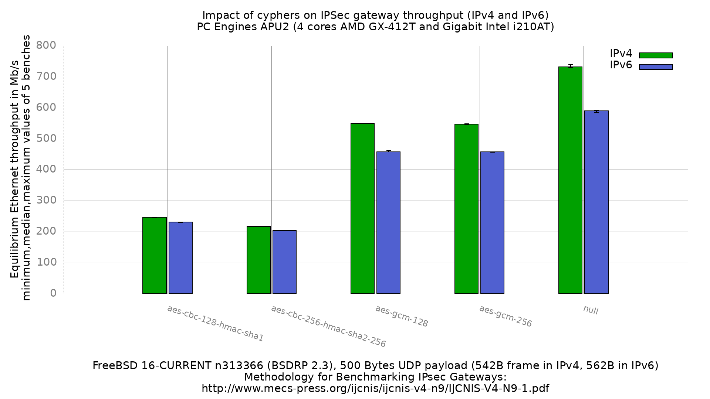

Impact of cyphers on IPsec performance (IPv4 and IPv6)
  - PC Engines APU2 (quad core AMD GX-412TC 1 GHz), DUT = apu2-3
  - 3 Intel i210AT Gigabit Ethernet ports
  - FreeBSD 16-CURRENT n313366 (BSDRP 2.3)
  - AES-NI enabled (`aesni0: <AES-CBC,AES-CCM,AES-GCM,AES-ICM,AES-XTS>`), `kern.crypto.allow_soft=0`
  - 4 SAD/SPD (2 IPv4, 2 IPv6), tunnel mode
  - 5000 flows of clear UDP packets
  - dev.igb.*.iflib.tx_abdicate=1
  - 500Bytes UDP load => 542B Ethernet frame in IPv4, 562B in IPv6



```
cypher                      IPv4   IPv6   delta
aes-cbc-128-hmac-sha1        247    231   -6.5%
aes-cbc-256-hmac-sha2-256    217    204   -6.0%
aes-gcm-128                  550    458  -16.7%
aes-gcm-256                  547    458  -16.3%
null                         732    590  -19.4%
```

The IPv6 cost grows as the cypher gets cheaper: 6% for the AES-CBC cyphers,
16% for AES-GCM and 19% for the null cypher. This is the expected ordering.
The IPv6 header is 20 bytes larger than the IPv4 one, so the frame goes from
542B to 562B for the same 500B UDP payload, and the per-packet processing is
heavier. On a cypher that is CPU-bound in the crypto code this overhead is
diluted, while on the null cypher it is nearly all of the cost.

## Comparison with the previous run (13-head r365873, IPv4)

```
cypher                      13-head r365873   16-CURRENT n313366   ratio
aes-cbc-128-hmac-sha1                    66                  247   x3.7
aes-cbc-256-hmac-sha2-256                62                  217   x3.5
aes-gcm-128                             489                  550   x1.12
aes-gcm-256                             488                  547   x1.12
null                                    763                  732   x0.96
```

The two AES-CBC cyphers are 3.5 to 3.7 times faster, while AES-GCM only gains
the 12% expected from three FreeBSD versions, and the null cypher is 4% slower.

The null cypher is the control: it runs the same tunnel, the same 5000 flows
and the same 542B frames but does no encryption at all. Its result being
unchanged shows the forwarding path and the bench methodology are comparable
with the previous run, so the AES-CBC gain is not an artefact of the lab.
Had the traffic been bypassing the tunnel, or the offered load been measured
differently, null and AES-GCM would have moved by the same factor as AES-CBC.

The gain is therefore specific to AES-CBC. The r365873 numbers (66 and 62 Mb/s)
are also about 3 times *slower* than the same bench on FreeBSD 11 on this same
hardware (189 Mb/s, see [fbsd11.0](../fbsd11.0/README.md)), while AES-GCM was
already fast there: the previous run is the outlier, not this one. This is the
signature of AES-CBC not being served by aesni(4) in r365873 and being served
again now, but this has not been bisected: the exact commit is not identified.

For reference, on this DUT AES-NI is in the kernel (not a module),
`kern.crypto.allow_soft` is 0 and no cryptosoft provider is attached, so the
SAs can only be served by aesni(4).

## UDP checksums over IPv6

UDP checksums are mandatory over IPv6, so a packet generator computing a
single checksum for a whole address range would show up here as discarded
packets. Checked on the DUT and on the reference endpoint while the bench was
running: `netstat -s -p ip6` reports no bad, discarded or truncated packet,
`netstat -s -p udp` reports 0 bad checksum and 0 missing checksum, and the
reference endpoint forwarded exactly the number of packets it decrypted.
The current pkt-gen computes a correct checksum per packet over the whole
source/destination range, and the IPv6 values above are the ordinary IPv6
overhead, not silent packet loss.

## Raw data

`RAW/` holds the per-iteration equilibrium output, `bench.inet4.*` and
`bench.inet6.*`. The `*.inet4.equilibrium` / `*.inet6.equilibrium` files are the
5 equilibrium values per cypher and address family, `*.equilibrium.max` the
maximum value seen during each search. `gnuplot.data[.max]` is their ministat
aggregation, and `inet4.data` / `inet6.data` are the per-family split used to
draw the grouped histogram.
