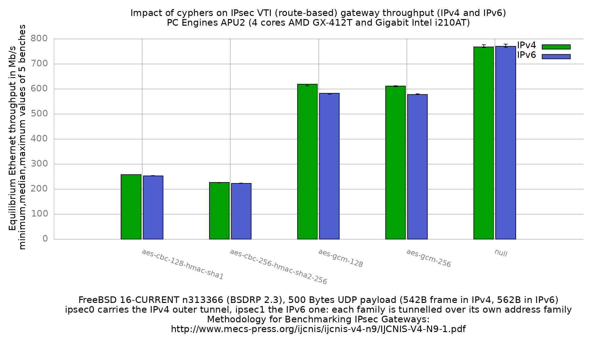

Impact of cyphers on IPsec VTI (route-based) performance (IPv4 and IPv6)
  - PC Engines APU2 (quad core AMD GX-412TC 1 GHz), DUT = apu2-3
  - 3 Intel i210AT Gigabit Ethernet ports
  - FreeBSD 16-CURRENT n313366 (BSDRP 2.3)
  - AES-NI enabled (`aesni0: <AES-CBC,AES-CCM,AES-GCM,AES-ICM,AES-XTS>`)
  - **VTI (route-based)**: one `if_ipsec(4)` interface per address family,
    since the interface carries a single outer endpoint pair. `ipsec0` holds
    the IPv4 outer (reqid 100), `ipsec1` the IPv6 outer (reqid 101), and the
    SAs bind to the matching reqid. No SPD entry.
  - 4 SAs per cypher (2 IPv4 on reqid 100, 2 IPv6 on reqid 101), tunnel mode
  - 5000 flows of clear UDP packets
  - dev.igb.*.iflib.tx_abdicate=1
  - 500Bytes UDP load => 542B Ethernet frame in IPv4, 562B in IPv6



```
cypher                      IPv4   IPv6   delta
aes-cbc-128-hmac-sha1        258    253   -1.9%
aes-cbc-256-hmac-sha2-256    226    223   -1.3%
aes-gcm-128                  619    582   -6.0%
aes-gcm-256                  611    578   -5.4%
null                         767    770   +0.4%
```

Values are Mb/s, median of 5 benches. Spread is 1 to 4 Mb/s per cypher.

## Each family is tunnelled over its own address family

`if_ipsec(4)` carries one outer endpoint pair per interface: `struct
ipsec_softc` holds a single `u_int family`, and `SIOCSIFPHYADDR` /
`SIOCSIFPHYADDR_IN6` write the same slot. An `ifconfig_ipsec0_ipv6` line adds
an *inner* address, not a second outer. Two interfaces are therefore required
to tunnel both families natively, which is what this configuration does.

Verified on the live DUT during the run:

```
ipsec0: tunnel inet 198.18.1.205 --> 198.18.1.203
ipsec1: tunnel inet6 2001:2:0:1::205 --> 2001:2:0:1::203
        esp mode=tunnel spi=4097 reqid=100   (IPv4 outer pair)
        esp mode=tunnel spi=4099 reqid=101   (IPv6 outer pair)
```

and on the generator side `equilibrium -6` reports a 562B frame against 542B
for `-4`, so the two arms really did carry different address families.

## VTI against policy-based, same image and same cyphers

The [policy-based result set](../fbsd16-n313366.BSDRP.2.3.policy-based/README.md)
of this same image configures IPsec with `spdadd` policies and no tunnel
interface. Both sets tunnel each family over its own address family, so they
are comparable in IPv4 and IPv6.

```
                             IPv4                    IPv6
cypher                      pol    VTI   gain      pol    VTI   gain
aes-cbc-128-hmac-sha1       247    258    +4%      231    253   +10%
aes-cbc-256-hmac-sha2-256   217    226    +4%      204    223    +9%
aes-gcm-128                 550    619   +13%      458    582   +27%
aes-gcm-256                 547    611   +12%      458    578   +26%
null                        732    767    +5%      590    770   +31%
```

VTI is faster in every case, and the gain is two to six times larger on IPv6
than on IPv4.

## Both datapaths cost packet rate on IPv6, policy-based much more

Mb/s hides part of this, because an IPv6 frame carries 20 more bytes for the
same payload and those bytes count as throughput. In packets per second:

```
                             policy-based              VTI
cypher                      v4 kpps v6 kpps v6/v4   v4 kpps v6 kpps v6/v4
null                          162.8   126.7  0.78     170.6   165.4  0.97
aes-gcm-128                   122.3    98.4  0.80     137.7   125.0  0.91
aes-gcm-256                   121.7    98.4  0.81     135.9   124.1  0.91
aes-cbc-128-hmac-sha1          54.9    49.6  0.90      57.4    54.3  0.95
aes-cbc-256-hmac-sha2-256      48.3    43.8  0.91      50.3    47.9  0.95
```

Both lose packet rate on IPv6, but policy-based loses 9 to 22% where VTI loses
3 to 9%. The SPD lookup is the obvious suspect, since it is the one stage VTI
does not execute, but nothing here localises the cost and no profiling was
done. Reported as measured.

## The null cypher behaves differently in the two datapaths, unexplained

Under VTI, `null` is the cypher that cares *least* about the address family
(0.97). Under policy-based it cares *most* (0.78).

A per-packet-overhead model predicts the opposite for VTI: with no crypto to
amortise, the heavier IPv6 header should hurt most. It does not. In Mb/s the
VTI `null` row even reads +0.4% for IPv6, which is the 20 extra header bytes
counted as throughput while the packet rate drops 3%.

The two datapaths disagree about `null` and this bench does not explain why.

## Comparison with the other interface-based VPNs

Same DUT, same image, same method, IPv4, all three routing into a kernel
interface:

```
VPN          cypher                 Mb/s    kpps
OpenVPN DCO  null                    900   207.6
IPsec VTI    null                    767   170.6
IPsec VTI    aes-gcm-128             619   137.7
IPsec VTI    aes-gcm-256             611   135.9
WireGuard    chacha20-poly1305       413    95.2
OpenVPN DCO  aes-gcm-128             365    84.2
OpenVPN DCO  aes-gcm-256             351    81.0
IPsec VTI    aes-cbc-128-hmac-sha1   258    57.4
IPsec VTI    aes-cbc-256-hmac-sha256 226    50.3
```

OpenVPN DCO has the fastest forwarding path of the three (900 Mb/s on the null
cypher against 767 for VTI) and the slowest AES-GCM (365 against 619). Those
two facts belong together: `if_ovpn(4)` moves packets well, and on this CPU its
AES-GCM costs much more per packet than the one IPsec drives through
`aesni(4)`. A single ranking of the three VPNs would hide that.

The cypher is not held constant across the three, and cannot be: WireGuard
implements only ChaCha20-Poly1305, and neither `if_ovpn(4)` nor `if_ipsec(4)`
offers it here. On this 1 GHz CPU with AES-NI present but no ChaCha
acceleration, the AES-GCM entries use a hardware-accelerated cypher and the
WireGuard entry does not. The `null` rows are not a cypher anyone would
deploy; they bound the forwarding path of each implementation with the crypto
removed.

([WireGuard](../../../wireguard/results/fbsd16-n313366.BSDRP.2.3/README.md),
[OpenVPN DCO](../../../openvpn/results/fbsd16-n313366.BSDRP.2.3/README.md),
[policy-based IPsec](../fbsd16-n313366.BSDRP.2.3.policy-based/README.md).)

## Raw data

`RAW/` holds the per-iteration equilibrium output, `bench.inet4.*` and
`bench.inet6.*`. The `inet4.*.equilibrium` / `inet6.*.equilibrium` files are
the 5 equilibrium values per cypher and address family, `*.equilibrium.max` the
maximum value seen during each search. `gnuplot.data[.max]` is their ministat
aggregation, and `inet4.data` / `inet6.data` are the per-family split used to
draw the grouped histogram.

Post-processed with `scripts/bench-equilibrium-ministat.sh`, which reads the
`.sender` files since the equilibrium search runs on the generator. Run once
per address family, then merged with the family as a row prefix.
