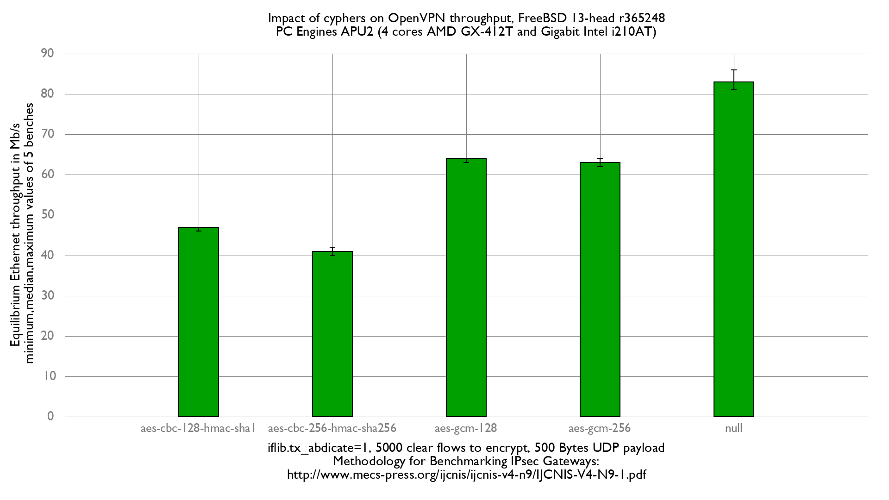
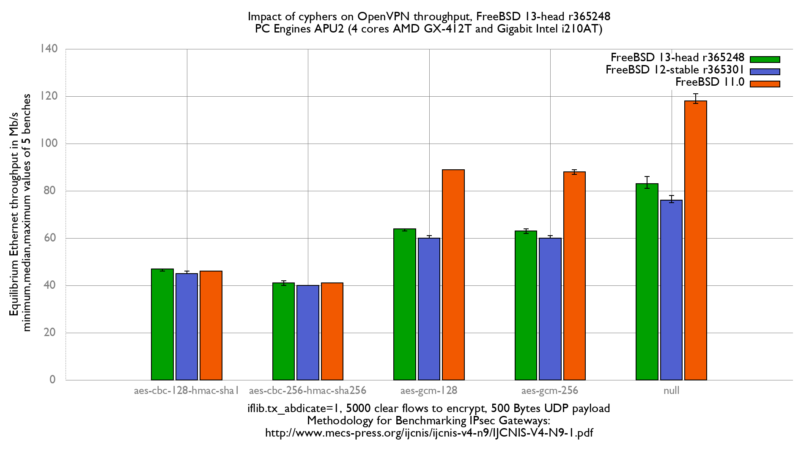

OpenVPN performance
  - PC Engines APU2C4 (quad core AMD GX-412T Processor 1 GHz)
  - 3 Intel i210AT Gigabit Ethernet ports
  - FreeBSD 13-head r365248
  - AESNI module loaded
  - OpenVPN 2.4.9
  - 5000 flows of UDP packets
  - 500Bytes UDP load => packet size: 528B => Ethernet frame size:542B

