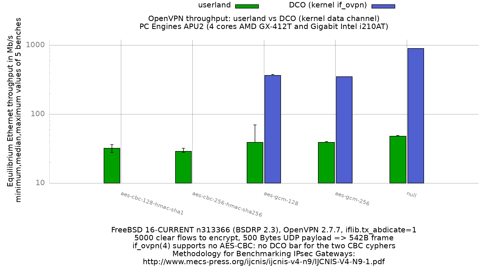

OpenVPN performance: userland versus DCO
  - PC Engines APU2 (quad core AMD GX-412TC 1 GHz), DUT = apu2-3
  - 3 Intel i210AT Gigabit Ethernet ports
  - FreeBSD 16-CURRENT n313366 (BSDRP 2.3)
  - OpenVPN 2.7.7 (previous result sets used 2.4.9)
  - AES-NI compiled in the kernel (`aesni0: <AES-CBC,AES-CCM,AES-GCM,AES-ICM,AES-XTS>`)
  - 5000 flows of clear UDP packets
  - dev.igb.*.iflib.tx_abdicate=1
  - 500Bytes UDP load => packet size: 528B => Ethernet frame size: 542B



```
cypher                      userland    DCO    DCO gain
aes-cbc-128-hmac-sha1             32      -           -
aes-cbc-256-hmac-sha256           29      -           -
aes-gcm-128                       39    365       x9.4
aes-gcm-256                       39    351       x9.0
null                              48    900      x18.8
```

Values are Mb/s, median of 5 benches. The graph uses a logarithmic y axis: the
DCO null result is 19 times the userland one and a linear scale flattens the
whole userland series into the baseline.

## DCO only covers three of the five cyphers

`if_ovpn(4)` accepts only the none, AES-GCM (128/192/256) and
CHACHA20-POLY1305 cyphers (`sys/net/if_ovpn.c`, `ovpn_create_kkey_dir()`,
which returns EINVAL for anything else): AES-CBC with a separate HMAC cannot
be offloaded. The two AES-CBC configuration sets
therefore exist in userland mode only, and have no DCO bar on the graph.

## DCO is 9 to 19 times faster

Moving the data channel into the kernel removes a userland round trip per
packet, and on this hardware that is what dominates. The null cypher, which
does no encryption at all, reaches 900 Mb/s in DCO: close to the line rate of
the Gigabit link for 542B frames, meaning the APU2 has stopped being the
bottleneck. In userland the same configuration only reaches 48 Mb/s.

The DCO numbers are also remarkably stable: aes-gcm-256 and null returned the
same value on all 5 iterations.

## Comparison with the previous run, and its limits

```
cypher                      13-head r365248   16-CURRENT n313366   ratio
(OpenVPN)                             2.4.9                2.7.7
aes-cbc-128-hmac-sha1                    46                   32    x0.70
aes-cbc-256-hmac-sha256                  41                   29    x0.71
aes-gcm-128                              63                   39    x0.62
aes-gcm-256                              61                   39    x0.64
null                                     81                   48    x0.59
```

Every userland cypher is 29 to 41% slower than the previous run, and the null
cypher, which does no crypto, drops the most. That ordering says the loss is
not in the crypto code but in the per-packet userland path that every cypher
shares: with no encryption to amortise it, the overhead is the whole cost.
The DCO results support the same reading, since bypassing that path recovers
an order of magnitude.

Do not read this table as "OpenVPN 2.7.7 is 30% slower than 2.4.9". Two things
changed at once: the OpenVPN version (2.4.9 to 2.7.7) and the FreeBSD version
(13-head to 16-CURRENT). A third difference is in the configuration itself:
`--ncp-disable` no longer exists in 2.7, so the data channel cypher is now
pinned with `--data-ciphers` plus `--data-ciphers-fallback`. That is the
documented equivalent, but it is a configuration change on top of the two
version bumps. Isolating the responsible change would need a 2.4.9 build on
this same FreeBSD 16 image, which was not done here.

For reference the previous userland results were very stable across three
FreeBSD versions with the same OpenVPN: 46, 45 and 46 Mb/s for
aes-cbc-128-hmac-sha1 on FreeBSD 11.0, 12-r365301 and 13-r365248.

## One unexplained outlier

The aes-gcm-128 userland set contains a single 70 Mb/s iteration against 39,
39, 39 and 43 for the other four. It is a properly converged equilibrium
search (53, 66, 69 then 70 Mb/s sustained at 71 Mb/s offered), not a truncated
run, and it sits above the 63 Mb/s of the previous result set. It is kept in
the data as measured. The other four sets show nothing comparable, and the two
most stable ones (aes-gcm-256 and null, 1 Mb/s spread over 5 iterations) rule
out general lab noise as the explanation.

## Lab

Generator and receiver: sm1. DUT: apu2-3. OpenVPN server endpoint: sm2.
See `../../bench-lab-3nodes.config` for the topology and `../../lab/` for the
generator configuration.

Two details of this bench are worth knowing before reproducing it:

- The route to 198.19.0.0/16 is pushed by the OpenVPN server through the
  tunnel, so the DUT must not have a static one. A leftover static route sends
  the traffic straight out igb2 and the bench silently measures plain
  forwarding instead of the tunnel.
- `IS_DUT_ONLINE_CMD` must only ping directly connected addresses.
  `reboot_host()` loops on that command run on the DUT, so a ping that crosses
  the tunnel makes the reboot wait depend on the tunnel re-establishing and the
  run dies on a false "not reachable" timeout. The tunnel is checked separately
  by `BEFORE_CMD`, once per bench, and its output is kept in `RAW/*.before`.
  All 40 benches of this result set recorded a working tunnel.

## Raw data

`RAW/` holds the per-iteration equilibrium output, `bench.userland.*` and
`bench.dco.*`, plus the `*.before` tunnel checks. The `*.userland.equilibrium`
and `*.dco.equilibrium` files are the 5 equilibrium values per cypher and mode,
`*.equilibrium.max` the maximum value seen during each search.
`gnuplot.data[.max]` is their ministat aggregation, and `userland.data` /
`dco.data` are the per-mode split used to draw the grouped histogram (the CBC
rows in `dco.data` are zeroed so the bars keep their slot).
