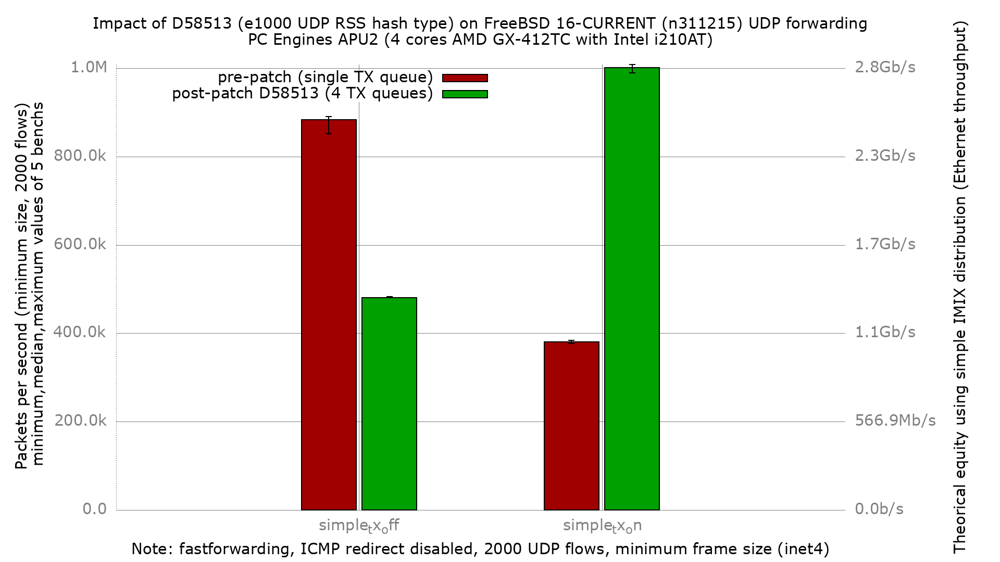

# Impact of D58513 (e1000 UDP RSS hash type) on APU2 UDP forwarding

[D58513](https://reviews.freebsd.org/D58513) — *"e1000: set UDP RSS hash type
on igb/em receive"* — makes the igb/em driver tag forwarded **UDP** packets with
a real RSS hash type. This is the before/after bench of that patch on the APU2 /
i210, measured against the pre-patch baseline in
[`../fbsd16-n311215/`](../fbsd16-n311215/README.md).

## The bug the patch fixes

`{igb,em}_determine_rsstype()` mapped the hardware RSS descriptor type to an
`M_HASHTYPE_*`, but its `switch` only handled TCP and bare-IP types — the three
UDP types (`E1000_RXDADV_RSSTYPE_IPV4_UDP` / `IPV6_UDP` / `IPV6_UDP_EX`) fell to
`default: M_HASHTYPE_NONE`.

The i210 hardware **does** hash UDP (igb RSS init enables the UDP fields), so the
mbuf carried a valid, well-spread `flowid` — but with `M_HASHTYPE_NONE`, iflib's
TX-queue selector skips the flowid-based `QIDX()` spread and drops every forwarded
UDP packet onto a **single** TX queue. All egress serialized on one core.

The patch adds the three missing UDP cases to both driver files. Note the i210
uses `igb_txrx.c` (`igb_determine_rsstype`), **not** `em_txrx.c` — `em_txrx`
serves em/82574/i350-as-em and legacy `lem`. Both are patched for correctness;
only `igb_txrx` is exercised here. Patch:
`~/BSDRP/BSDRP/patches/freebsd.em-rss-udp-hashtype.patch`.

## Hardware

- PC Engines APU2
- CPU: AMD GX-412TC SOC, 4 cores @ ~1 GHz (K8-class)
- NIC: 3x Intel i210AT (igb), traffic on igb1 (in) / igb2 (out)

## Software

- FreeBSD 16.0-CURRENT (BSDRP), **patched** image label `n311215-UDP2`
- Baseline: unpatched `fbsd16-n311215` (same source revision, no patch)
- `net.isr.dispatch=direct`, 4 netmap-bound netisr threads (one RX queue/core)
- fastforwarding on (ICMP redirect disabled), Ethernet flow control off

## Bench

- pkt-gen (netmap) minimum-size (60 B) UDP frames, 2000 flows
  (20 src ports x 100 dst addrs)
- 5 iterations per data point, DUT rebooted between every run, receiver-side pps
- Two config sets, identical except the read-only loader tunable:
  - `simple_tx_off_default`: driver default (tunable unset)
  - `simple_tx_on`: `dev.igb.0/1/2.iflib.simple_tx="1"` in `loader.conf.local`
- Sender offered 1.456 Mpps (`Speed: 1456303 pps`) — well above both DUT
  ceilings, so the numbers below are true DUT limits, not sender-limited.

## Result



Median forwarded pps (5 iterations, IPv4):

| simple_tx | pre-patch (`fbsd16-n311215`) | post-patch (`fbsd16-n311215.D58513`) | change |
|-----------|------------------------------|--------------------------------------|--------|
| off (default) | 883,374 | 480,840 | **−45.2 %** |
| on            | 379,926 | 1,001,291 | **+162.9 % (×2.6)** |

**The patch reverses which configuration is fast.** Pre-patch, forwarded UDP
serialized on one TX queue in both configs (`simple_tx=off` used TX queue 0,
`simple_tx=on` used the last queue), and `off` happened to be the faster of the
two single-queue paths. Post-patch, UDP egress spreads across **all four** TX
queues in both configs — verified live on igb2:

```
simple_tx=off  txq0=199142 txq1=201092 txq2=202044 txq3=202342   (~even)
simple_tx=on   txq0=71.2M  txq1=72.9M  txq2=72.4M  txq3=71.9M     (~even)
```

With the serialization removed, the lighter of the two TX paths wins:
**`simple_tx=on` now forwards 1.0 Mpps**, beating the pre-patch best (883 K) by
13 %, while `simple_tx=off` settles at 481 K.

### ministat, simple_tx=off (pre vs post patch)

```
x fbsd16-n311215/simple_tx_off_default.inet4.pps
+ fbsd16-n311215.D58513/simple_tx_off_default.pps
    N           Min           Max        Median           Avg        Stddev
x   5        851176        890326        883374      877643.6     15603.947
+   5        480735        483269        480840      481363.8     1077.5373
Difference at 95.0% confidence
	-396280 +/- 16130.3
	-45.1527% +/- 1.01359%
```

### ministat, simple_tx=on (pre vs post patch)

```
x fbsd16-n311215/simple_tx_on.inet4.pps
+ fbsd16-n311215.D58513/simple_tx_on.pps
    N           Min           Max        Median           Avg        Stddev
x   5      376570.5        384448        379926      380354.2     2824.2224
+   5        989769       1008354     1001291.5      999776.7     6748.4226
Difference at 95.0% confidence
	619422 +/- 7544.35
	162.854% +/- 2.72016%
```

## Why: CPU profiling (hwpmc / flamegraph)

Profiled the patched DUT with `hwpmc` while forwarding IPv4 60 B frames
(event `BU_CPU_CLK_UNHALTED`, the AMD GX-412TC cycle counter), rendered as
flamegraphs.

- OFF: [`PMC/forwarding.simple_tx_off.svg`](PMC/forwarding.simple_tx_off.svg)
- ON:  [`PMC/forwarding.simple_tx_on.svg`](PMC/forwarding.simple_tx_on.svg)

Folded call graphs and netstat loss checks are under [`PMC/`](PMC/).

### Capture note

At line rate the 4-core APU2 pins every core in the RX/forward taskqueue and
userland `pmcstat` starves — a full-rate capture returned 24 samples. Both
profiles were therefore taken at **300 Kpps offered** (below both forwarding
ceilings), `pmcstat` driven manually mid-blast (≈990 K samples each). Cycle
*proportions* are rate-independent, which is what the diagnosis needs.
`netstat -ndi` before/after each run showed igb1 Ipkts == igb2 Opkts with zero
Ierrs/Idrop/Oerrs (no DUT loss) — see `PMC/netstat.*`.

### Finding

The pre-patch ON regression (documented in the baseline README) was 46.8 % of
cycles in `lock_delay`, reached through `iflib_simple_transmit` — the simple TX
ring taking the txq mutex per transmit while all UDP piled on one queue. **That
`lock_delay` is now gone** (2–4 samples, 0.00 %): with UDP spread across four
queues there is no single-queue contention left to spin on.

That fixes ON. It also explains why OFF is now the *slower* of the two — the two
TX paths differ in per-packet cost, and once neither serializes, the difference
shows:

| TX-path self-cost (share of samples) | OFF (`iflib_if_transmit`) | ON (`iflib_simple_transmit`) |
|--------------------------------------|---------------------------|------------------------------|
| `iflib_txd_db_check`                 | 6.48 %                    | –                            |
| `ifmp_ring_enqueue`                  | 5.02 %                    | –                            |
| `iflib_encap`                        | 4.93 %                    | 2.59 %                       |
| `iflib_txq_drain`                    | 1.98 %                    | –                            |
| `iflib_simple_transmit` (self)       | –                         | 1.35 %                       |
| `igb_isc_txd_credits_update`         | (in RX)                   | 1.87 %                       |
| **≈ TX path total**                  | **≈ 18 %**                | **≈ 6 %**                    |

The default path drives the multi-producer `mp_ring`
(`iflib_if_transmit → ifmp_ring_enqueue → iflib_txq_drain → iflib_encap` +
doorbell batching in `iflib_txd_db_check`) — roughly 18 % of cycles. The
`simple_tx` path bypasses that machinery and enqueues directly (~6 %). That is
exactly what `simple_tx` was designed to do; pre-patch its advantage was buried
under the single-queue `lock_delay`, and the patch is what lets it surface.

## Takeaway

On this APU2 / i210, D58513 turns forwarded-UDP egress from single-queue into
4-queue, and the recommended configuration flips: **enable `simple_tx` with the
patch** for 1.0 Mpps, versus 0.88 Mpps as the best the unpatched driver could do.
