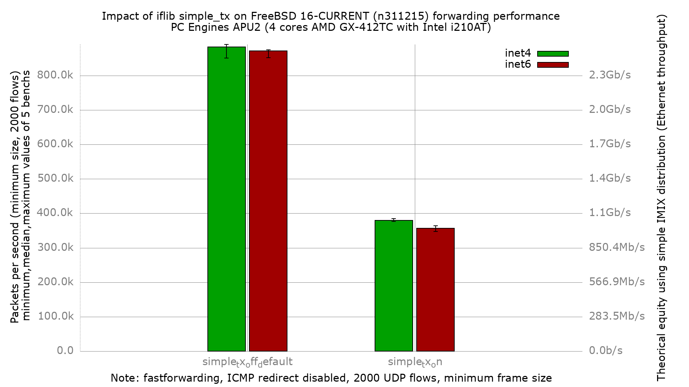

# Impact of iflib `simple_tx` on APU2 forwarding performance

Does enabling the iflib `simple_tx` ("use simple tx ring") tunable change
IPv4/IPv6 packet forwarding throughput on a low-end multi-queue Intel igb
NIC?

## Hardware

- PC Engines APU2 (DUT: `apu2-2`)
- CPU: AMD GX-412TC SOC, 4 cores @ ~1 GHz (K8-class)
- NIC: 3x Intel i210AT (igb), traffic on igb1 (in) / igb2 (out)

## Software

- FreeBSD 16.0-CURRENT (BSDRP, image label `fbsd16-n311215`)
- fastforwarding enabled (ICMP redirect disabled)
- Ethernet flow control disabled on all igb ports

## What `simple_tx` does

`dev.igb.<n>.iflib.simple_tx` selects iflib's "simple tx ring" transmit
path. Unlike `tx_abdicate`, this knob is a **read-only tunable**
(`CTLFLAG_RDTUN` in `sys/net/iflib.c`): it is read once at driver attach
and cannot be changed at runtime, so it must be set in
`boot/loader.conf.local`, not `sysctl.conf`. The bench measures the
forwarding cost of that alternate TX path.

## Bench

- pkt-gen (netmap) minimum-size UDP frames, 2000 flows (`dualstack-2k`)
- 5 iterations per data point, DUT rebooted between every run
- Two config sets, identical except for the tunable:
  - `simple_tx_off_default`: driver default (tunable unset)
  - `simple_tx_on`: `dev.igb.0/1/2.iflib.simple_tx="1"` in loader.conf.local

The `simple_tx=1` tunable was confirmed applied on the live DUT after
boot (`dev.igb.0/1/2.iflib.simple_tx: 1`).

## Result



Median pps (5 iterations):

| config | inet4 | inet6 |
|-----------------------|-----------|-----------|
| simple_tx off (default) | 883,374 | 871,344 |
| simple_tx on            | 379,926 | 356,360 |

**Enabling `simple_tx` is a large regression on this platform: forwarding
throughput drops ~57% (IPv4) / ~59% (IPv6), a factor of ~2.3x slower.**
The effect is highly significant and well outside the run-to-run noise
band. On this APU2 / i210 the simple tx ring should stay disabled.

### ministat, IPv4 (off vs on)

```
x simple_tx_off_default.inet4.pps
+ simple_tx_on.inet4.pps
+--------------------------------------------------------------------------+
|+                                                                         |
|++                                                                      x |
|++                                                                 x   xxx|
|MA                                                                   |_AM||
+--------------------------------------------------------------------------+
    N           Min           Max        Median           Avg        Stddev
x   5        851176        890326        883374      877643.6     15603.947
+   5      376570.5        384448        379926      380354.2     2824.2224
Difference at 95.0% confidence
	-497289 +/- 16353.4
	-56.6619% +/- 0.861136%
	(Student's t, pooled s = 11212.9)
```

### ministat, IPv6 (off vs on)

```
x simple_tx_off_default.inet6.pps
+ simple_tx_on.inet6.pps
+--------------------------------------------------------------------------+
| +                                                                      x |
| +                                                                      x |
|+++                                                                   x xx|
||A|                                                                   |_A||
+--------------------------------------------------------------------------+
    N           Min           Max        Median           Avg        Stddev
x   5        851685      874740.5        871344      867461.9      9118.495
+   5      347884.5        363561        356360      356020.2     5561.7962
Difference at 95.0% confidence
	-511442 +/- 11014.9
	-58.9584% +/- 0.796958%
	(Student's t, pooled s = 7552.5)
```

## Why: CPU profiling (hwpmc / flamegraph)

To explain the regression we profiled the DUT with `hwpmc` while it was
forwarding IPv4 minimum-size frames (event `BU_CPU_CLK_UNHALTED`, the
AMD GX-412TC cycle counter), and rendered the callgraphs as flamegraphs.

Profiles are stored under [`PMC/`](PMC/): the folded callgraphs
(`PMC/{off,on}/…​.pmc.graph`) and the two flamegraph SVGs.

- OFF: [`PMC/forwarding.simple_tx_off.svg`](PMC/forwarding.simple_tx_off.svg)
- ON:  [`PMC/forwarding.simple_tx_on.svg`](PMC/forwarding.simple_tx_on.svg)

### Capture note

The OFF profile was taken at the bench's 850 Kpps offered rate. At that
rate with `simple_tx=1` the DUT CPU is 100% pinned and `sshd` starves, so
the ON profile was instead captured at **300 Kpps offered** (just under
the ON forwarding capacity) with `pmcstat` driven manually mid-blast. The
two captures therefore have different absolute sample counts; what matters
for the diagnosis is the *proportion* of cycles each function consumes,
which is rate-independent here. Both captures were verified busy (OFF 10%
idle, ON 3.5% idle) and `netstat -ndi` before/after each run showed
igb1 Ipkts == igb2 Opkts with zero Ierrs/Idrop/Oerrs (no DUT loss); the
snapshots are in `PMC/netstat.*`.

### Finding

The two profiles differ in one decisive place — lock contention in the
transmit path:

| path frame            | OFF (default)      | ON (`simple_tx=1`)     |
|-----------------------|--------------------|------------------------|
| TX entry              | `iflib_encap` (batched mp_ring) | `iflib_simple_transmit` |
| cycles in `lock_delay`| ~0% (29 / 2.22M samples) | **46.8% (42,295 / 90,349 samples)** |

With `simple_tx=1`, 97% of that `lock_delay` time is reached directly
through `iflib_simple_transmit` on the RX-taskqueue forwarding path
(`iflib_rxeof → … → ip_tryforward → ether_output → iflib_simple_transmit
→ lock_delay`). The simple TX ring takes the txq mutex per transmit; on
this 4-core APU2 the RX taskqueue and the TX side then spin contending on
that lock, burning ~47% of the CPU in `lock_delay` instead of forwarding.

The default path (`iflib_encap` via the lock-free `mp_ring`) shows
essentially no `lock_delay` and spends its cycles in actual TX/RX work.
This lock contention is the mechanism behind the ~57% throughput drop
documented above.
