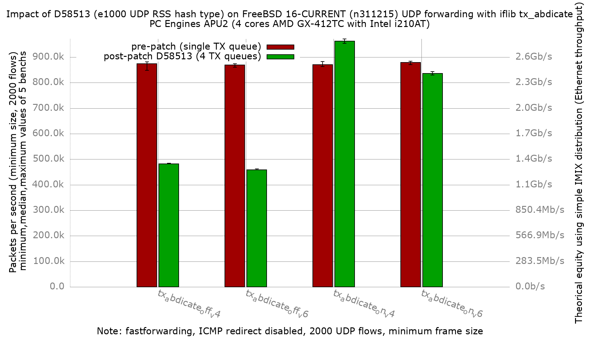

# Impact of D58513 (e1000 UDP RSS hash type) on APU2 forwarding, with `tx_abdicate`

[D58513](https://reviews.freebsd.org/D58513) — *"e1000: set UDP RSS hash type
on igb/em receive"* — makes the igb/em driver tag forwarded **UDP** packets with
a real RSS hash type so iflib spreads egress across all TX queues instead of
serializing on one. This re-runs the `tx_abdicate` bench on the patched driver
and compares it to the pre-patch baseline in
[`../fbsd16-n311215/`](../fbsd16-n311215/README.md).

The pre-patch baseline found `tx_abdicate` had **no meaningful effect** (off ≈ on
≈ 870 Kpps). This bench shows why, and what changes once the patch is in.

## Hardware

- PC Engines APU2 (DUT: `apu2-2`)
- CPU: AMD GX-412TC SOC, 4 cores @ ~1 GHz (K8-class)
- NIC: 3x Intel i210AT (igb), traffic on igb1 (in) / igb2 (out)

## Software

- FreeBSD 16.0-CURRENT (BSDRP), **patched** image label `n311215-UDP2`
- Baseline: unpatched `fbsd16-n311215` (same source revision, no patch)
- `net.isr.dispatch=direct`, 4 netmap-bound netisr threads (one RX queue/core)
- fastforwarding on (ICMP redirect disabled), Ethernet flow control off
- Patch: `~/BSDRP/BSDRP/patches/freebsd.em-rss-udp-hashtype.patch`

## What `tx_abdicate` does

`dev.igb.<n>.iflib.tx_abdicate` controls whether the iflib transmit path hands
the doorbell/DMA-start (`mp_ring` drain) work to the TX taskqueue (`=1`) instead
of doing it inline in the caller's context (`=0`, driver default). On the
forwarding path the caller is the RX/forward thread, so `=1` moves that work off
the RX hot path onto a separate TX taskqueue thread.

## Bench

- pkt-gen (netmap) minimum-size UDP frames, 2000 flows (`dualstack-2k`, IPv4 + IPv6)
- 5 iterations per data point, DUT rebooted between every run, receiver-side pps
- Two config sets, identical except the runtime sysctl:
  - `txabdicate_off`: driver default (no `tx_abdicate` set)
  - `txabdicate_on`: `dev.igb.0/1/2.iflib.tx_abdicate=1`

## Result



Median forwarded pps (5 iterations):

| config | AF | pre-patch | post-patch | change |
|--------|----|-----------|------------|--------|
| tx_abdicate off | inet4 | 874,254 | 481,689 | **−44.6 %** |
| tx_abdicate off | inet6 | 869,638 | 458,996 | **−47.1 %** |
| tx_abdicate on  | inet4 | 870,917 | 963,155 | **+10.2 %** |
| tx_abdicate on  | inet6 | 878,642 | 836,565 | **−4.7 %** |

**The patch is what makes `tx_abdicate` matter.** Pre-patch, forwarded UDP
serialized on a single TX queue no matter the knob, so off and on were
indistinguishable (~870 K both). Post-patch, egress spreads across all four TX
queues (verified live on igb2, all `txqN.txq_processed` counters advancing
evenly in both configs), and the two paths now diverge sharply:

- `tx_abdicate=off` (inline mp_ring drain on the RX thread) drops to ~480 Kpps —
  the same ceiling the default `iflib_if_transmit` path hits in the
  [simple_tx=off bench](../../simple_tx/results/fbsd16-n311215.D58513/README.md).
- `tx_abdicate=on` (drain offloaded to the TX taskqueue) reaches ~963 Kpps for
  IPv4, the fastest configuration measured here and 10 % above the pre-patch
  best.

So on the patched driver the recommendation flips from *"tx_abdicate doesn't
matter"* to **"enable tx_abdicate"** — it is what keeps the default path's
per-packet drain cost off the saturated RX-forward core.

### ministat, IPv4 tx_abdicate off (pre vs post patch), pps

```
x pre-patch  fbsd16-n311215/txabdicate_off.inet4.pps
+ post-patch  fbsd16-n311215.D58513/txabdicate_off.inet4.pps
    N           Min           Max        Median           Avg        Stddev
x   5        848829        881892      874254.5      871117.3     13248.124
+   5        481575        484165        481689      482200.4     1108.7424
Difference at 95.0% confidence
	-388917 +/- 13710.2
	-44.6458% +/- 0.878033%
```

### ministat, IPv4 tx_abdicate on (pre vs post patch), pps

```
x pre-patch  fbsd16-n311215/txabdicate_on.inet4.pps
+ post-patch  fbsd16-n311215.D58513/txabdicate_on.inet4.pps
    N           Min           Max        Median           Avg        Stddev
x   5        862766        882314        870917      873663.3     8437.4294
+   5        954549        971320        963155      962967.9     6392.0913
Difference at 95.0% confidence
	89304.6 +/- 10916.4
	10.2219% +/- 1.33206%
```

### ministat, IPv6 tx_abdicate off (pre vs post patch), pps

```
x pre-patch  fbsd16-n311215/txabdicate_off.inet6.pps
+ post-patch  fbsd16-n311215.D58513/txabdicate_off.inet6.pps
    N           Min           Max        Median           Avg        Stddev
x   5      860941.5      874032.5      869638.5      868780.6     4955.6706
+   5      458827.5        461885      458996.5      459600.4     1291.0505
Difference at 95.0% confidence
	-409180 +/- 5281.24
	-47.0982% +/- 0.346887%
```

### ministat, IPv6 tx_abdicate on (pre vs post patch), pps

```
x pre-patch  fbsd16-n311215/txabdicate_on.inet6.pps
+ post-patch  fbsd16-n311215.D58513/txabdicate_on.inet6.pps
    N           Min           Max        Median           Avg        Stddev
x   5      871028.5        884170      878642.5      878211.5     4975.8403
+   5        830105      843408.5      836565.5      836668.9      4753.619
Difference at 95.0% confidence
	-41542.6 +/- 7096.78
	-4.73036% +/- 0.78834%
```

## Why: CPU profiling (hwpmc / flamegraph)

Profiled the patched DUT with `hwpmc` while forwarding IPv4 60 B frames
(event `BU_CPU_CLK_UNHALTED`, the AMD GX-412TC cycle counter). `tx_abdicate` is
a runtime sysctl, so both profiles were taken on the same boot by flipping the
knob between captures.

- OFF: [`PMC/forwarding.txabdicate_off.svg`](PMC/forwarding.txabdicate_off.svg)
- ON:  [`PMC/forwarding.txabdicate_on.svg`](PMC/forwarding.txabdicate_on.svg)

Folded call graphs and netstat loss checks are under [`PMC/`](PMC/).

### Capture note

At line rate the 4-core APU2 pins every core in the RX/forward taskqueue and
userland `pmcstat` starves. Both profiles were therefore taken at **300 Kpps
offered** (below both forwarding ceilings), `pmcstat` driven mid-blast
(≈980–990 K samples each). Cycle *proportions* are rate-independent, which is
what the diagnosis needs. `netstat -ndi` before/after each run showed igb1
Ipkts == igb2 Opkts with zero Ierrs/Idrop/Oerrs (no DUT loss) — see `PMC/netstat.*`.

### Finding

The two profiles differ in where the `mp_ring` transmit machinery runs:

| frame (share of cycles)      | OFF (`tx_abdicate=0`) | ON (`tx_abdicate=1`) |
|------------------------------|-----------------------|----------------------|
| `iflib_txd_db_check`         | 6.37 %                | 0.50 %               |
| `ifmp_ring_enqueue`          | 4.93 %                | 1.08 %               |
| `iflib_encap`                | 4.88 %                | 3.04 %               |
| `iflib_txq_drain`            | 2.02 %                | 0.62 %               |
| **≈ TX drain on RX thread**  | **≈ 18 %**            | **≈ 5 %**            |

With `tx_abdicate=0` the RX/forward thread drains the `mp_ring` inline —
`iflib_if_transmit → ifmp_ring_enqueue → iflib_txq_drain → iflib_encap`, plus
doorbell batching in `iflib_txd_db_check` — burning ~18 % of cycles on the
already-saturated forwarding core. With `tx_abdicate=1` the enqueue hands off and
the drain runs on the TX taskqueue (`_task_fn_tx`) instead, leaving ~5 % on the
RX thread. Off-loading that ~18 % is what lifts throughput from ~480 K to ~960 K
once the patch has spread egress across four queues to offload onto.

This is exactly the behaviour `tx_abdicate` was designed for; it was invisible
pre-patch only because single-queue serialization was the dominant cost and
masked it.

## Takeaway

On this APU2 / i210, D58513 turns forwarded-UDP egress from single-queue into
4-queue, which is what finally makes `tx_abdicate` worth enabling: **patched +
`tx_abdicate=1` forwards ~0.96 Mpps (IPv4)**, versus ~0.87 Mpps as the best the
unpatched driver could do regardless of the knob.
