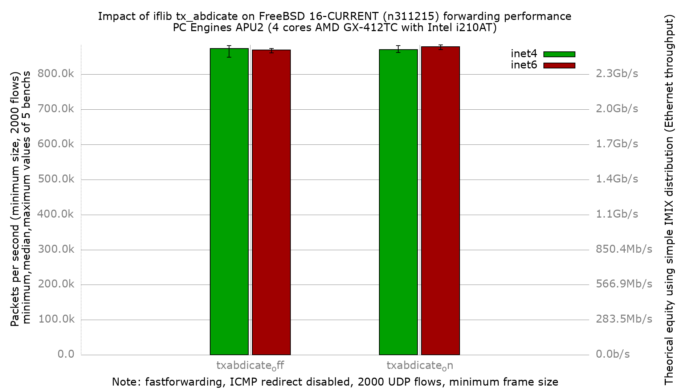

# Impact of iflib `tx_abdicate` on APU2 forwarding performance

Does enabling the iflib `tx_abdicate` sysctl change IPv4/IPv6 packet
forwarding throughput on a low-end multi-queue Intel igb NIC?

## Hardware

- PC Engines APU2 (DUT: `apu2-2`)
- CPU: AMD GX-412TC SOC, 4 cores @ ~1 GHz (K8-class)
- NIC: 3x Intel i210AT (igb), traffic on igb1 (in) / igb2 (out)

## Software

- FreeBSD 16.0-CURRENT (BSDRP, image label `fbsd16-n311215`)
- fastforwarding enabled (ICMP redirect disabled)
- Ethernet flow control disabled on all igb ports

## What `tx_abdicate` does

`dev.igb.<n>.iflib.tx_abdicate` controls whether the iflib transmit path
hands the actual doorbell/DMA-start work to the taskqueue (`=1`) instead
of pushing it inline in the caller's context (`=0`, driver default). The
idea is to batch transmits and reduce per-packet TX overhead. This bench
measures whether that trade-off is visible on this hardware.

## Bench

- pkt-gen (netmap) minimum-size UDP frames, 2000 flows (`dualstack-2k`)
- 5 iterations per data point, DUT rebooted between every run
- Two config sets, identical except:
  - `txabdicate_off`: driver default (no `tx_abdicate` sysctl set)
  - `txabdicate_on`: `dev.igb.0/1/2.iflib.tx_abdicate=1`

## Result



Median pps (5 iterations):

| config | inet4 | inet6 |
|-----------------|-----------|-----------|
| tx_abdicate off | 874,254   | 869,638   |
| tx_abdicate on  | 870,917   | 878,642   |

`tx_abdicate` has no operationally meaningful effect on this platform.
For IPv4 the difference is not statistically significant; for IPv6 it is,
but the gain is ~1% -- inside the run-to-run noise band you would care
about in practice.

### ministat, IPv4 (off vs on)

```
x txabdicate_off.inet4.pps
+ txabdicate_on.inet4.pps
+--------------------------------------------------------------------------+
|x                            +              +*      x           x   *+    |
|                   |______________|__________MA____AM_______________|____||
+--------------------------------------------------------------------------+
    N           Min           Max        Median           Avg        Stddev
x   5        848829        881892      874254.5      871117.3     13248.124
+   5        862766        882314        870917      873663.3     8437.4294
No difference proven at 95.0% confidence
```

### ministat, IPv6 (off vs on)

```
x txabdicate_off.inet6.pps
+ txabdicate_on.inet6.pps
+--------------------------------------------------------------------------+
|x                    x     x    +x       x      +       +      +         +|
|         |_______________A_M___________||_____________A_M_____________|   |
+--------------------------------------------------------------------------+
    N           Min           Max        Median           Avg        Stddev
x   5      860941.5      874032.5      869638.5      868780.6     4955.6706
+   5      871028.5        884170      878642.5      878211.5     4975.8403
Difference at 95.0% confidence
	9430.9 +/- 7242.28
	1.08553% +/- 0.838133%
	(Student's t, pooled s = 4965.77)
```
