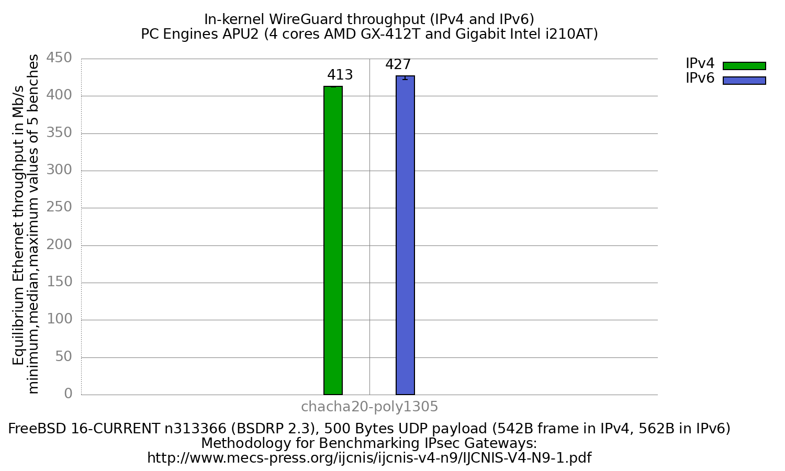

In-kernel WireGuard performance (IPv4 and IPv6)
  - PC Engines APU2 (quad core AMD GX-412TC 1 GHz), DUT = apu2-3
  - 3 Intel i210AT Gigabit Ethernet ports
  - FreeBSD 16-CURRENT n313366 (BSDRP 2.3)
  - In-kernel WireGuard, `if_wg(4)`, configured by wireguard-tools 1.0.20260223
  - ChaCha20-Poly1305 (the only cypher WireGuard has)
  - 5000 flows of clear UDP packets
  - dev.igb.*.iflib.tx_abdicate=1
  - 500Bytes UDP load => 542B Ethernet frame in IPv4, 562B in IPv6



```
                     IPv4   IPv6
Mb/s (median of 5)    413    427
kpps                 95.2   95.0
```

Values are the equilibrium Ethernet throughput, median of 5 benches. The
spread is 1 Mb/s in IPv4 (412-413) and 5 Mb/s in IPv6 (422-427).

## IPv6 is not faster, the frames are bigger

IPv6 measures 3.4% *more* Mb/s than IPv4, which is the opposite of what every
other VPN bench on this machine shows. It is an artefact of the unit, not a
result.

The equilibrium method reports Ethernet throughput in Mb/s, and the same 500B
UDP payload travels in a 542B frame in IPv4 against a 562B frame in IPv6. Per
packet, IPv6 carries 3.7% more bytes. Converting both results to packets per
second gives 95.2 kpps in IPv4 and 95.0 kpps in IPv6: the same packet rate to
within 0.3%.

So the honest statement is that `if_wg(4)` on this hardware forwards the same
number of packets per second whichever address family is used, and the Mb/s
difference is entirely the larger IPv6 header being counted as throughput.

## The IPv6 cost differs from IPsec on the same DUT

The IPsec bench of this machine, same DUT, same generator, same methodology,
loses packet rate on IPv6 while WireGuard does not:

```
                             v4 kpps   v6 kpps   v6/v4
IPsec null                     168.8     131.2   0.78
IPsec aes-gcm-128              126.8     101.9   0.80
IPsec aes-cbc-128-hmac-sha1     57.0      51.4   0.90
WireGuard chacha20-poly1305     95.2      95.0   1.00
```

(IPsec figures computed from
[../../../ipsec/results/fbsd16-n313366.BSDRP.2.3/](../../../ipsec/results/fbsd16-n313366.BSDRP.2.3/README.md).)

This is a measured difference, not an explained one. A plausible reading is
that ChaCha20-Poly1305 on a 1 GHz core without any crypto offload is dominated
by the per-byte cypher cost, so the 20 extra header bytes and the heavier IPv6
header processing are lost in the noise; on the cheaper IPsec cyphers that
same overhead is a visible share of the total. That has not been profiled
here, so it is a hypothesis rather than a conclusion.

## No comparison with the previous WireGuard result set

The previous result set,
[fbsd13-r364937.D26137](../fbsd13-r364937.D26137/README.md), reported 483 Mb/s
for kernel WireGuard against 413 Mb/s here. **Do not read that as a 14%
regression**: the two runs are not comparable.

- The lab is different. The old configuration sets address a DUT at
  198.18.0.244 with management on 192.168.100.44 and a peer at 198.18.1.204,
  a topology this lab no longer has. The current three-node lab (apu2-3,
  sm1, sm2) was used here and the configuration sets had to be rewritten for
  it; the old ones cannot be run to check.
- FreeBSD went from 13-head r365033 to 16-CURRENT n313366.
- The old run used 2000 flows, this one 5000.

Isolating the effect of any one of those would need the old lab back, which
is not available. The number is reported as measured and the comparison is
left open.

## The userland versus kernel comparison is gone

The previous result set compared WireGuard userland (wireguard-go 1.0.20200827)
against the kernel module. That comparison cannot be reproduced on BSDRP 2.3:
the image ships `wireguard-tools` and the in-kernel `if_wg(4)`, and has no
`wireguard-go` binary. `wg-quick up` on this image configures the kernel
interface, so both of the old configuration sets would now measure the same
kernel datapath. Only the kernel result is therefore reported.

## if_wg(4) is configured by wg(8), not by ifconfig

The pre-FreeBSD-14 configuration sets of this bench put the private key and the
peer in `create_args_wg0`, as `ifconfig wg0 create private-key ... peer ...`.
That interface no longer exists: on FreeBSD 16 it fails with

```
ifconfig: private-key: bad value
```

`rc.conf` still creates `wg0` and puts the addresses on it, but the key and the
peer come from `wg(8)` alone. The configuration sets used here therefore carry
`/etc/wg0.conf` and apply it from `/etc/rc.local`:

```sh
[ -f /etc/wg0.conf ] && /usr/bin/wg setconf wg0 /etc/wg0.conf
```

`/etc/rc.d/local` sources `/etc/rc.local` late in the boot, after
`cloned_interfaces` has created `wg0`. Without this the interface comes up
with no key, no peer and a random listen port, and the bench measures nothing:
`wg show` reports only `listening port: <random>`.

## Checking the tunnel was really used

`BEFORE_CMD` runs on the DUT before each bench and its output is kept in
`RAW/*.before`. It pings the receiver across the tunnel with an explicit
source address and then dumps `wg show`, so every iteration has a record of
the handshake age and the transferred byte counters:

```
2 packets transmitted, 2 packets received, 0.0% packet loss
...
  latest handshake: 2 seconds ago
  transfer: 124 B received, 660 B sent
```

The route to 198.19.0.0/16 points at 198.18.2.203, the peer's wg0 address, so
a tunnel that failed to come up would leave the DUT with no usable route and
the bench would measure 0, not a wrong number.

## Compared with the other interface-based VPNs on this DUT

All three of these move the data channel into a kernel interface, so they are
comparable: `if_wg(4)` here, `if_ovpn(4)` for OpenVPN DCO, `if_ipsec(4)` for
IPsec VTI. All three were measured on this same DUT, generator and FreeBSD
image, with the same equilibrium method and 500B UDP payload, IPv4.

```
VPN          cypher                 Mb/s    kpps
OpenVPN DCO  null                    900   207.6
IPsec VTI    null                    766   176.7
IPsec VTI    aes-gcm-128             614   141.6
IPsec VTI    aes-gcm-256             612   141.1
WireGuard    chacha20-poly1305       413    95.2
OpenVPN DCO  aes-gcm-128             365    84.2
OpenVPN DCO  aes-gcm-256             351    81.0
IPsec VTI    aes-cbc-128-hmac-sha1   258    59.5
IPsec VTI    aes-cbc-256-hmac-sha256 226    52.1
```

WireGuard sits between the two AES-GCM implementations: 1.13x OpenVPN DCO's
aes-gcm-128, and 0.67x IPsec VTI's. The `null` rows are not a cypher anyone
would deploy; they bound the forwarding path of each implementation with the
crypto removed.

The cypher is not held constant across the three, and cannot be: WireGuard
implements only ChaCha20-Poly1305, and neither `if_ovpn(4)` nor `if_ipsec(4)`
offers it here. So this table compares each VPN as it is actually deployed,
not the same cypher on three stacks. On this 1 GHz CPU with AES-NI present but
no ChaCha acceleration, that distinction matters: the AES-GCM entries use a
hardware-accelerated cypher and the WireGuard entry does not, which is a
property of the comparison and not a defect in it.

([IPsec VTI](../../../ipsec/results/fbsd16-n313366.BSDRP.2.3.vti/README.md),
[OpenVPN DCO](../../../openvpn/results/fbsd16-n313366.BSDRP.2.3/README.md).)

## Raw data

`RAW/` holds the per-iteration equilibrium output, `bench.inet4.*` and
`bench.inet6.*`, plus the `*.before` tunnel checks. The
`inet4.chacha20-poly1305.equilibrium` / `inet6.*` files are the 5 equilibrium
values per address family, `*.equilibrium.max` the maximum value seen during
each search. `gnuplot.data[.max]` is their ministat aggregation, and
`inet4.data` / `inet6.data` are the per-family split used to draw the
histogram.
