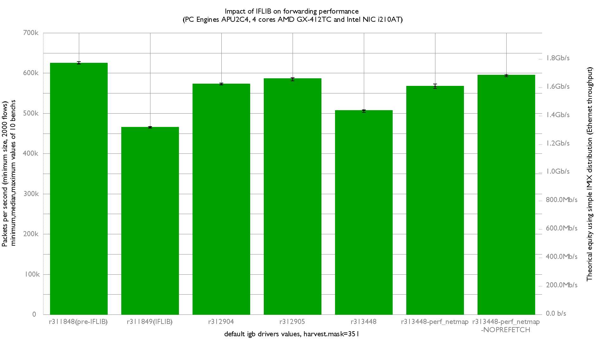

Impact of IFLIB on forwarding performance
  - PC Engines APU2C4 (quad core AMD GX-412T Processor 1 GHz)
  - 3 Intel i210AT Gigabit Ethernet ports
  - FreeBSD 12-head
  - 2000 flows of smallest UDP packets
  - No drivers tunning (default value)
  - harvest.mask=351
  - Traffic load at 1.448Mpps (Gigabit line-rate)




```
```
