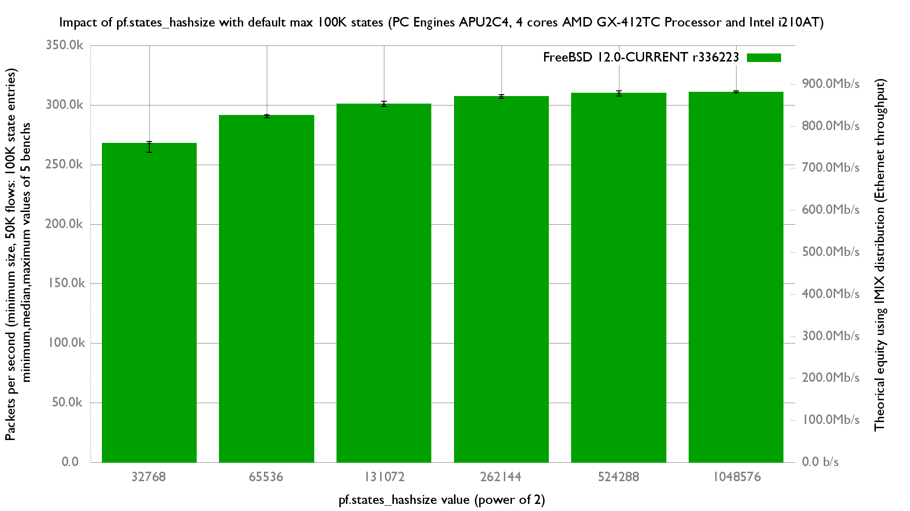

Impact of pf states_hashsize with 100K states
  - PC Engines APU2C4 (quad core AMD GX-412T Processor 1 GHz)
  - 3 Intel i210AT Gigabit Ethernet ports
  - FreeBSD 12.0-CURRENT r336223
  - 50K unidirection flows of smallest UDP packets (So 100K in pf states table)
  - 2 static routes
  - Traffic load at 14.88 Mpps




Very good benefit with states_hashsize increased from 32K to 256K (+15%):
```
x states_hashsize=32768 (default): Inet 4 packets-per-second forwarded
+ states_hashsize=262144: Inet 4 packets-per-second forwarded
+--------------------------------------------------------------------------+
|            x                                                          +  |
|x       x   x x                                                     + ++ +|
|    |____A__M__|                                                          |
|                                                                     |_A| |
+--------------------------------------------------------------------------+
    N           Min           Max        Median           Avg        Stddev
x   5        260282        269427        267960      266363.2     3667.2083
+   5        305603      308711.5        307072      307060.5     1128.8317
Difference at 95.0% confidence
        40697.3 +/- 3957.02
        15.2789% +/- 1.69411%
        (Student's t, pooled s = 2713.18)

```

Even better if increased to 512K (+16%):
```
x states_hashsize=32768 (default): Inet 4 packets-per-second forwarded
+ states_hashsize=524288: Inet 4 packets-per-second forwarded
+--------------------------------------------------------------------------+
|                                                                       +  |
|x       x  xxx                                                     ++  + +|
|   |_____A_M__|                                                           |
|                                                                    |_AM| |
+--------------------------------------------------------------------------+
    N           Min           Max        Median           Avg        Stddev
x   5        260282        269427        267960      266363.2     3667.2083
+   5        307461        311663        310025      309542.8     1669.6881
Difference at 95.0% confidence
        43179.6 +/- 4155.44
        16.2108% +/- 1.77211%
        (Student's t, pooled s = 2849.23)
```
