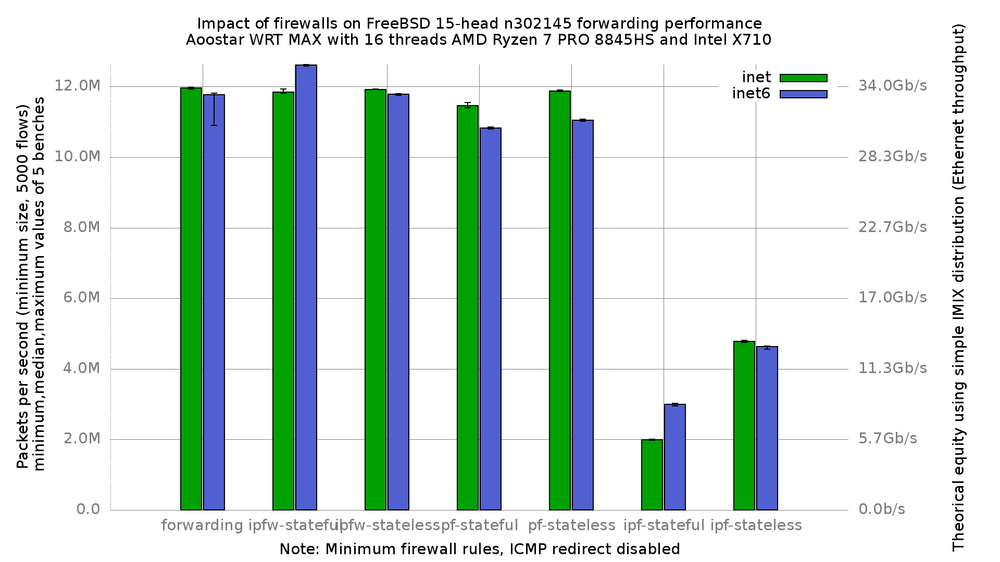

# Impact of firewalls on forwarding performance
Lab:
  - [Aoostar WTR MAX (8 cores x 2 threads AMD Ryzen 7 PRO 8845HS at 3.8GHz)](https://aoostar.com/products/aoostar-wtr-max-amd-r7-pro-8845hs-11-bays-mini-pc)
  - Intel X710
  - FreeBSD 15-head n302145 (e69573bc2be)
  - 5000 flows of smallest UDP packets
  - 2 static routes
  - Traffic load at 14.8 Mpps
  - harvest.mask=351
  - net.inet.ip.redirect=0
  - net.inet6.ip6.redirect=0
  - dev.ix.X.iflib.tx_abdicate=1

# Results

## Graph



## flamegraphs

### inet

  - [forwarding: inet](bench.forwarding.inet4.svg)
  - [ipfw-stateless: inet](bench.ipfw-stateless.inet4.svg)
  - [ipfw-stateful: inet](bench.ipfw-stateful.inet4.svg)
  - [pf-stateful: inet](bench.pf-stateful.inet4.svg)
  - [pf-stateless: inet](bench.pf-stateless.inet4.svg)
  - [ipf-stateless: inet](bench.ipf-stateless.inet4.svg)
  - [ipf-stateful: inet](bench.ipf-stateful.inet4.svg)

## inet6

  - [forwarding: inet6](bench.forwarding.inet6.svg)
  - [ipfw-stateless: inet6](bench.ipfw-stateless.inet6.svg)
  - [ipfw-stateful: inet6](bench.ipfw-stateful.inet6.svg)
  - [pf-stateless: inet6](bench.pf-stateless.inet6.svg)
  - [pf-stateful: inet6](bench.pf-stateful.inet6.svg)
  - [ipf-stateless: inet6](bench.ipf-stateful.inet6.svg)
  - [ipf-stateful: inet6](bench.ipf-stateless.inet6.svg)

## ministat

### firewalls

Unit: packets-per-second forwarded
```
x forwarding.inet4
+ ipfw-stateless.inet4
* ipfw-stateful.inet4
% pf-stateless.inet4
# pf-stateful.inet4
@ ipf-stateless.inet4
O ipf-stateful.inet4
+--------------------------------------------------------------------------+
|O                                                                         |
|O                                                                         |
|O                   @                                                #  O*|
|O                   @@                                               #  OO|
|O                   @@                                               ## OO|
|                                                                         A|
|                                                                         A|
|                                                                        A |
|                                                                        A||
|                                                                     A|   |
|                    A|                                                    |
|A                                                                         |
+--------------------------------------------------------------------------+
    N           Min           Max        Median           Avg        Stddev
x   5      11935201      11969766      11955149      11950860     14487.091
+   5      11914314      11929397      11918796      11920844     6383.9788
Difference at 95.0% confidence
	-30016 +/- 16326.4
	-0.251162% +/- 0.136326%
	(Student's t, pooled s = 11194.4)
*   5      11817771      11931008      11843044      11854206      44219.11
Difference at 95.0% confidence
	-96654 +/- 47987
	-0.808762% +/- 0.401223%
	(Student's t, pooled s = 32902.9)
%   5      11850201      11905180      11879006      11878409     26264.479
Difference at 95.0% confidence
	-72451 +/- 30933.1
	-0.606241% +/- 0.25847%
	(Student's t, pooled s = 21209.7)
#   5      11402734      11549084      11464634      11472243     53077.711
Difference at 95.0% confidence
	-478617 +/- 56740
	-4.00488% +/- 0.473484%
	(Student's t, pooled s = 38904.5)
@   5     4747375.5       4812834       4777395     4778620.4     25059.812
Difference at 95.0% confidence
	-7.17224e+06 +/- 29851.3
	-60.0144% +/- 0.221951%
	(Student's t, pooled s = 20467.9)
O   5     1972387.5       2011471     1988786.5     1992016.2     15251.843
Difference at 95.0% confidence
	-9.95884e+06 +/- 21693.4
	-83.3316% +/- 0.133252%
	(Student's t, pooled s = 14874.4)
```

### inet vs inet6

Unit: packets-per-second forwarded

```
x forwarding.inet4
+ forwarding.inet6
+--------------------------------------------------------------------------+
|+                   + + x +   +  x                         x    x        x|
|                              |____________________A_______M____________| |
|        |___________A_M________|                                          |
+--------------------------------------------------------------------------+
    N           Min           Max        Median           Avg        Stddev
x   5     4915543.5       5867096       5591154     5432378.7     409435.96
+   5       4440170     5023437.5       4874362     4823728.9     226254.57
Difference at 95.0% confidence
	-608650 +/- 482422
	-11.2041% +/- 8.12918%
	(Student's t, pooled s = 330779)
```
### IPv6 surprise

Enabling ipfw improve IPv6 forwarding performance:

```
x forwarding.inet6
+ ipfw-stateful.inet6
+--------------------------------------------------------------------------+
|                                                                         +|
|                                                                       + +|
|x                                   xxxx                               + +|
|             |________________A______M_________|                          |
|                                                                       |AM|
+--------------------------------------------------------------------------+
    N           Min           Max        Median           Avg        Stddev
x   5      10894598      11819392      11771167      11605902     398330.59
+   5      12583159      12624224      12616255      12605866     20461.717
Difference at 95.0% confidence
	999964 +/- 411330
	8.616% +/- 3.84873%
	(Student's t, pooled s = 282034)
```
