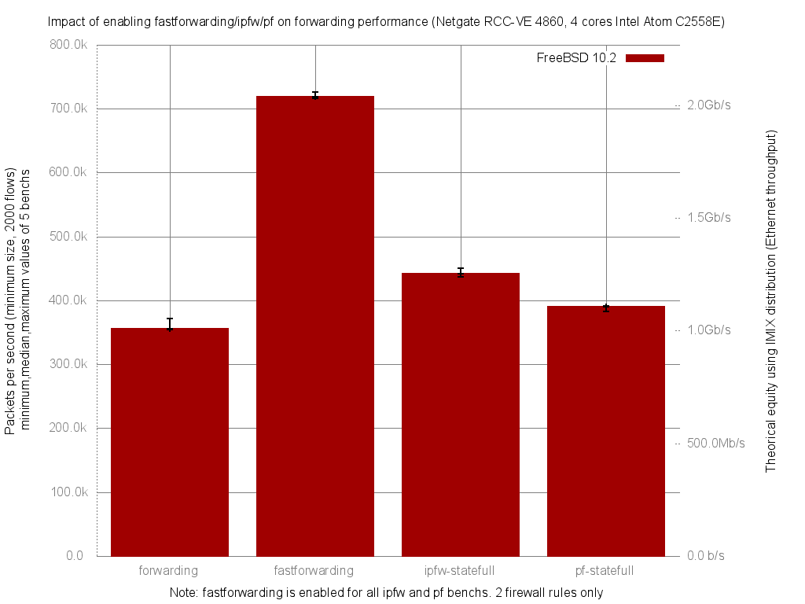

Impact of enabling fastforwarding/ipfw/pf on forwarding performance
  - Netgate RCC-VE 4860 (4 cores Intel Atom C2558E)
  - Quad port Intel i350
  - FreeBSD 11-routing.r287531
  - 2000 flows of smallest UDP packets
  - Traffic load at 1.448Mpps (Gigabit line-rate)




```
x pps.forwarding
+ pps.fastforwarding
* pps.ipfw-statefull
% pps.pf-statefull
+--------------------------------------------------------------------------+
|       %         *                                                     +  |
|x      %         *                                                     +  |
|xxx x %%%        ***                                                   +++|
||A_|                                                                      |
|                                                                       MA||
|                 MA|                                                      |
|      |A|                                                                 |
+--------------------------------------------------------------------------+
    N           Min           Max        Median           Avg        Stddev
x   5        354260        371618        355558      360025.8     7619.8259
+   5        715743        726727        718579      720556.8     4362.5544
Difference at 95.0% confidence
        360531 +/- 9054.9
        100.14% +/- 2.51507%
        (Student's t, pooled s = 6208.61)
*   5        437377        450092        441793      443000.6     4633.8213
Difference at 95.0% confidence
        82974.8 +/- 9197.1
        23.0469% +/- 2.55457%
        (Student's t, pooled s = 6306.11)
%   5        382637        390895        390226        388783     3465.3589
Difference at 95.0% confidence
        28757.2 +/- 8632.6
        7.98754% +/- 2.39777%
        (Student's t, pooled s = 5919.06)

```
