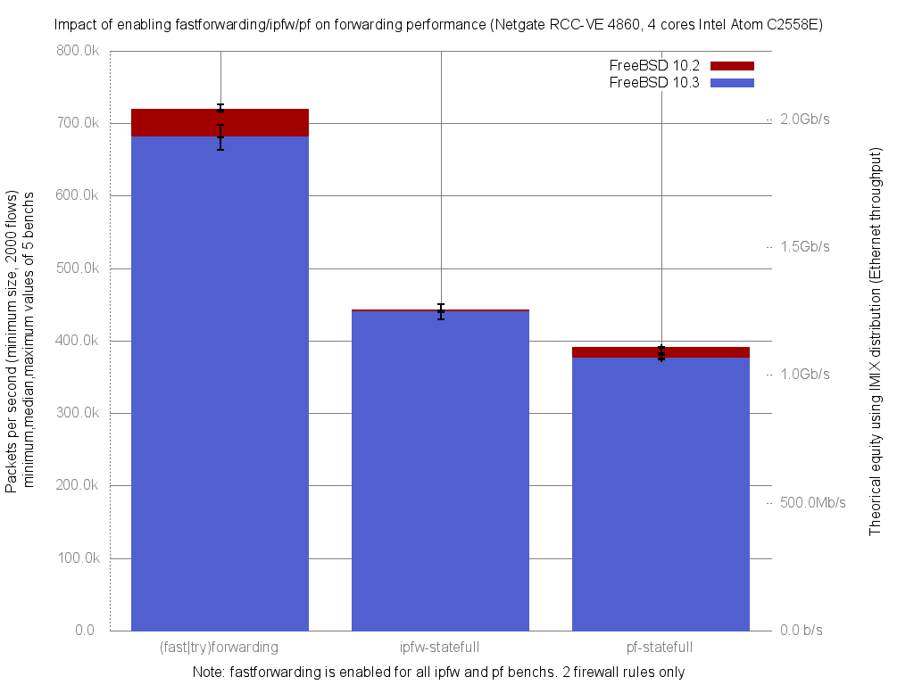

Impact of enabling ipfw or pf on forwarding performance: FreeBSD 10.2 vs 10.3
  - Netgate RCC-VE 4860 (4 cores Intel Atom C2558E)
  - Quad port Intel i350
  - FreeBSD 11-head r287478
  - 2000 flows of smallest UDP packets
  - Traffic load at 1.448Mpps (Gigabit line-rate)




fastforwarding (10.2) vs forwarding (10.3):
```
x fbsd10.3/pps.forwarding
+ fbsd10.2/pps.fastforwarding
+--------------------------------------------------------------------------+
|                 x                                              +         |
|x           x    xx   x          x  xx  x                   +   +    +   +|
|          |_________M__A____________|                                     |
|                                                             |__M_A____|  |
+--------------------------------------------------------------------------+
    N           Min           Max        Median           Avg        Stddev
x  10        663296        698299      680848.5     683440.15     11241.859
+   5        715743        726727        718579      720556.8     4362.5544
Difference at 95.0% confidence
        37116.7 +/- 11430.6
        5.43086% +/- 1.67251%
        (Student's t, pooled s = 9661.75)
```

ipfw:
```
x fbsd10.3/pps.ipfw-statefull
+ fbsd10.2/pps.ipfw-statefull
+--------------------------------------------------------------------------+
|                                    x      +                              |
|x               x x  x      +   x  xx   x x+       +                     +|
|              |_____________A_____M______|                                |
|                               |___________M____A_______________|         |
+--------------------------------------------------------------------------+
    N           Min           Max        Median           Avg        Stddev
x  10        429569        441322      438996.5      437376.7     3755.6616
+   5        437377        450092        441793      443000.6     4633.8213
Difference at 95.0% confidence
        5623.9 +/- 4787
        1.28583% +/- 1.09448%
        (Student's t, pooled s = 4046.22)
```

pf:
```
x fbsd10.3/pps.pf-statefull
+ fbsd10.2/pps.pf-statefull
+--------------------------------------------------------------------------+
|xxxx x x      xx  x        x       +                           + ++ +     |
||_____M__A________|                                                       |
|                                              |____________A_____M_______||
+--------------------------------------------------------------------------+
    N           Min           Max        Median           Avg        Stddev
x  10      373802.5        380689      375329.5      376136.6     2259.4908
+   5        382637        390895        390226        388783     3465.3589
Difference at 95.0% confidence
        12646.4 +/- 3181.02
        3.36218% +/- 0.845708%
        (Student's t, pooled s = 2688.76)
```
