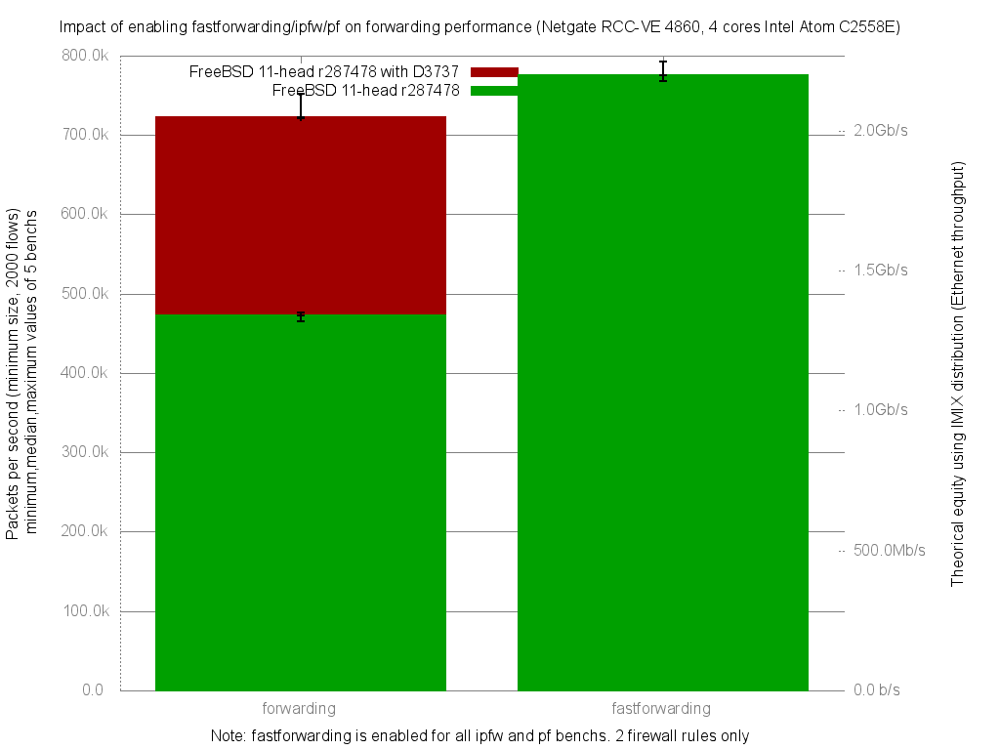

Comparing benefit of patch D3737 on forwarding performance
  - Netgate RCC-VE 4860 (4 cores Intel Atom C2558E)
  - Quad port Intel i350
  - FreeBSD 11 head r287478 with D3737 patch (no more fastforward sysctl)
  - 2000 flows of smallest UDP packets
  - Traffic load at 1.448Mpps (Gigabit line-rate)




```
x pps.forwarding
+ ../fbsd11-head.r287478/pps.fastforwarding
+--------------------------------------------------------------------------+
|   xxx                      x    x              + +     +              + +|
||____M_________A_____________|                                            |
|                                                |_______M___A__________|  |
+--------------------------------------------------------------------------+
    N           Min           Max        Median           Avg        Stddev
x   5        720732        751689        722532      732697.6     15043.302
+   5        767573        792812        774876      778932.4     11876.258
Difference at 95.0% confidence
        46234.8 +/- 19765.7
        6.31022% +/- 2.69766%
        (Student's t, pooled s = 13552.6)

```
