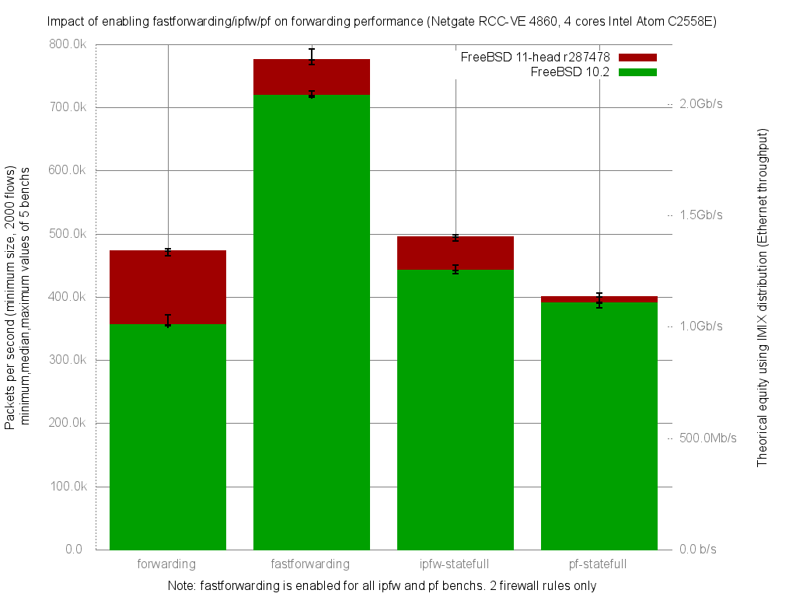

Impact of enabling fastforwarding/ipfw/pf on forwarding performance
  - Netgate RCC-VE 4860 (4 cores Intel Atom C2558E)
  - Quad port Intel i350
  - FreeBSD 11-routing.r287531
  - 2000 flows of smallest UDP packets
  - Traffic load at 1.448Mpps (Gigabit line-rate)




```
x pps.forwarding
+ pps.fastforwarding
* pps.ipfw-statefull
% pps.pf-statefull
+--------------------------------------------------------------------------+
|  %              *x                                                  ++   |
|%%%%             **x* *                                              ++  +|
|                 |A|                                                      |
|                                                                     |A_| |
|                |_MA_|                                                    |
||AM                                                                       |
+--------------------------------------------------------------------------+
    N           Min           Max        Median           Avg        Stddev
x   5        467439        479468        473342      473386.2     4515.9205
+   5        733976        754558        736941      740137.4     8299.7773
Difference at 95.0% confidence
        266751 +/- 9744.31
        56.3496% +/- 2.05843%
        (Student's t, pooled s = 6681.31)
*   5        467282        493311        472181      477218.8     11377.495
No difference proven at 95.0% confidence
%   5        382844        396805        390951      389987.8     5051.6963
Difference at 95.0% confidence
        -83398.4 +/- 6987.84
        -17.6174% +/- 1.47614%
        (Student's t, pooled s = 4791.3)
```
