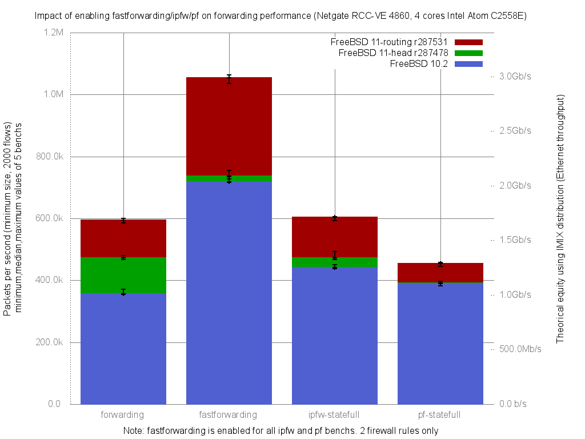

Impact of enabling fastforwarding/ipfw/pf on forwarding performance
  - Netgate RCC-VE 4860 (4 cores Intel Atom C2558E)
  - Quad port Intel i350
  - FreeBSD 11-routing.r287531
  - 2000 flows of smallest UDP packets
  - Traffic load at 1.448Mpps (Gigabit line-rate)




```
x pps.forwarding
+ pps.fastforwarding
* pps.ipfw-statefull
% pps.pf-statefull
+--------------------------------------------------------------------------+
| %                x*                                                    + |
|%%                x*                                                    + |
|%%              x***                                                  + ++|
|                 |A                                                       |
|                                                                      |_A||
|                  AM                                                      |
||A                                                                        |
+--------------------------------------------------------------------------+
    N           Min           Max        Median           Avg        Stddev
x   5        584757        600630        594994        593756     5939.4113
+   5       1035077       1063070       1053902     1052038.4     10446.542
Difference at 95.0% confidence
	458282 +/- 12392.8
	77.1836% +/- 2.08718%
	(Student's t, pooled s = 8497.26)
*   5        592182        605450        604410      601638.6     5519.1408
No difference proven at 95.0% confidence
%   5        445313        457295        454540      451734.4     5761.9666
Difference at 95.0% confidence
	-142022 +/- 8533.87
	-23.9192% +/- 1.43727%
	(Student's t, pooled s = 5851.36)
```
