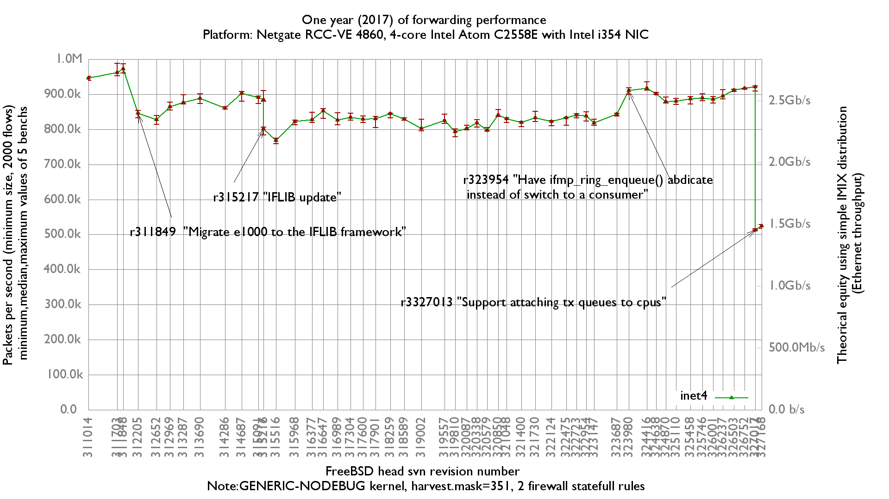

One year (2017) of forwarding performance
  - Netgate RCC-VE 4860 (4 cores Intel Atom C2558E)
  - Quad port Intel i350: e1000 / igb driver
  - 2000 flows of smallest UDP packets
  - 2 static routes
  - Traffic load at 1.488 Mpps (Gigabit line-rate)

