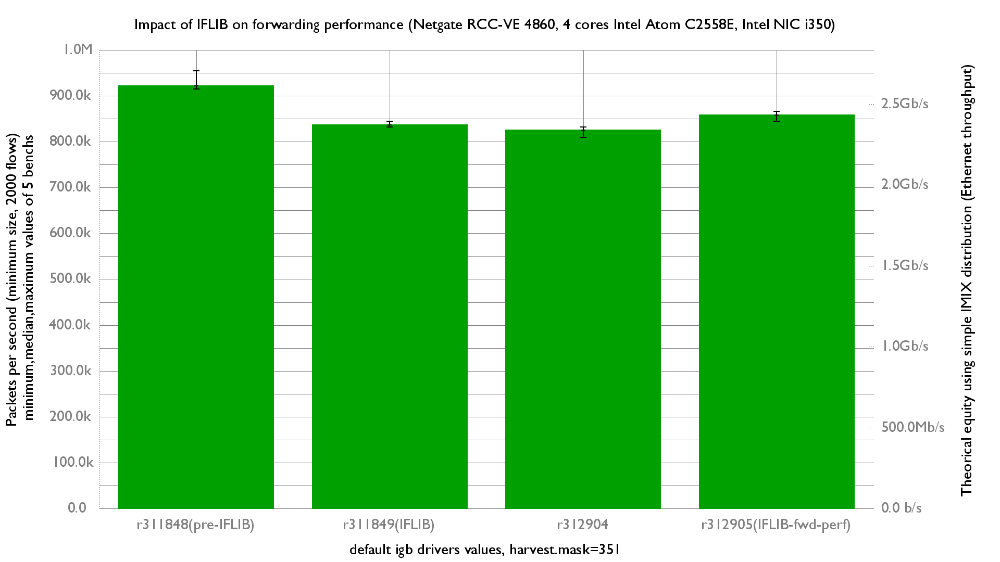

Impact of IFLIB on forwarding performance
  - Netgate RCC-VE 4860 (4 cores Intel Atom C2558E)
  - Quad port Intel i350
  - FreeBSD 12-head
  - Default igb drivers tuning
  - harvest.mask=351
  - 2000 flows of smallest UDP packets
  - Traffic load at 1.448Mpps (Gigabit line-rate)



```
x 311848.pps
+ 311849.pps
* 312904.pps
% 312905.pps
+--------------------------------------------------------------------------+
|        *  +             %                               x                |
|*       *  +* ++  @   %  %   %                       x x x               x|
|                                                   |_____M_A_______|      |
|           |__A__|                                                        |
|   |___AM___|                                                             |
|                    |___AM__|                                             |
+--------------------------------------------------------------------------+
    N           Min           Max        Median           Avg        Stddev
x   5        914766      954116.5        922009      926284.4     15859.578
+   5        831447      844325.5        836370      836664.5     5463.9576
Difference at 95.0% confidence
        -89619.9 +/- 17299
        -9.6752% +/- 1.70696%
        (Student's t, pooled s = 11861.3)
*   5        808986      832238.5        825526      823319.8      8602.824
Difference at 95.0% confidence
        -102965 +/- 18606.9
        -11.1159% +/- 1.83862%
        (Student's t, pooled s = 12758)
%   5        844948      865879.5        858075      856064.8     7792.8667
Difference at 95.0% confidence
        -70219.6 +/- 18223.4
        -7.58078% +/- 1.84817%
        (Student's t, pooled s = 12495.1)
```

