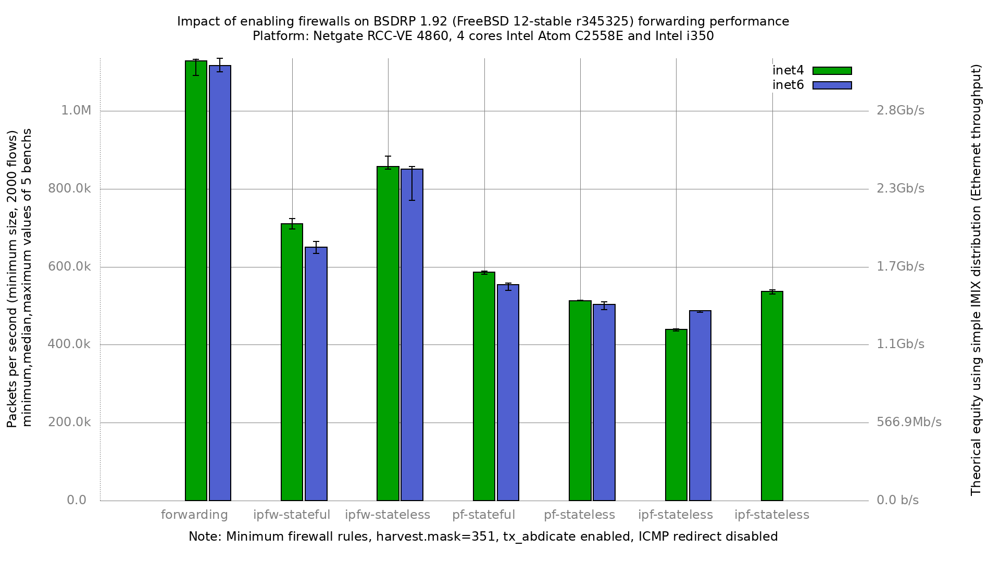

Impact of enabling ipfw, pf or ipf on forwarding performance
  - Netgate RCC-VE 4860 (4 cores Intel Atom C2558E)
  - Quad port Intel i350
  - FreeBSD 12-STABLE r345325 (BSDRP 1.92)
  - 2000 flows of smallest UDP packets
  - Traffic load at 1.448Mpps (Gigabit line-rate)
  - harvest.mask=351
  - net.inet.ip.redirect=0
  - net.inet6.ip6.redirect=0
  - txabdicate enabled

