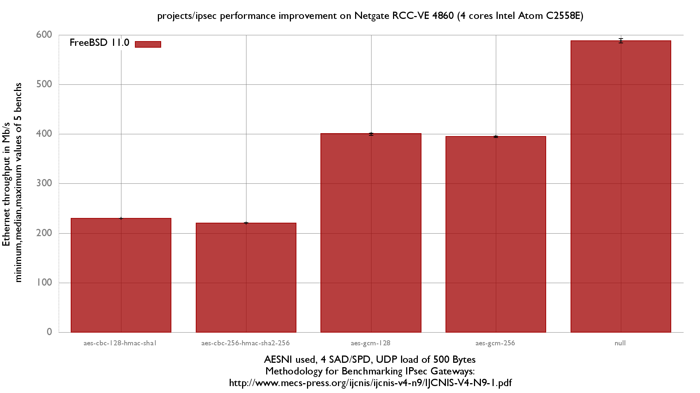

IPsec performance 
  - Netgate RCC-VE 4860 (4 cores Intel Atom C2558E)
  - Quad port Intel i350
  - FreeBSD 11.0
  - 4 SAD/SPD (2 IPv4, 2 IPv6)
  - 2000 flows of UDP packets
  - 500Bytes UDP load => packet size: 528B => Ethernet frame size:542B

