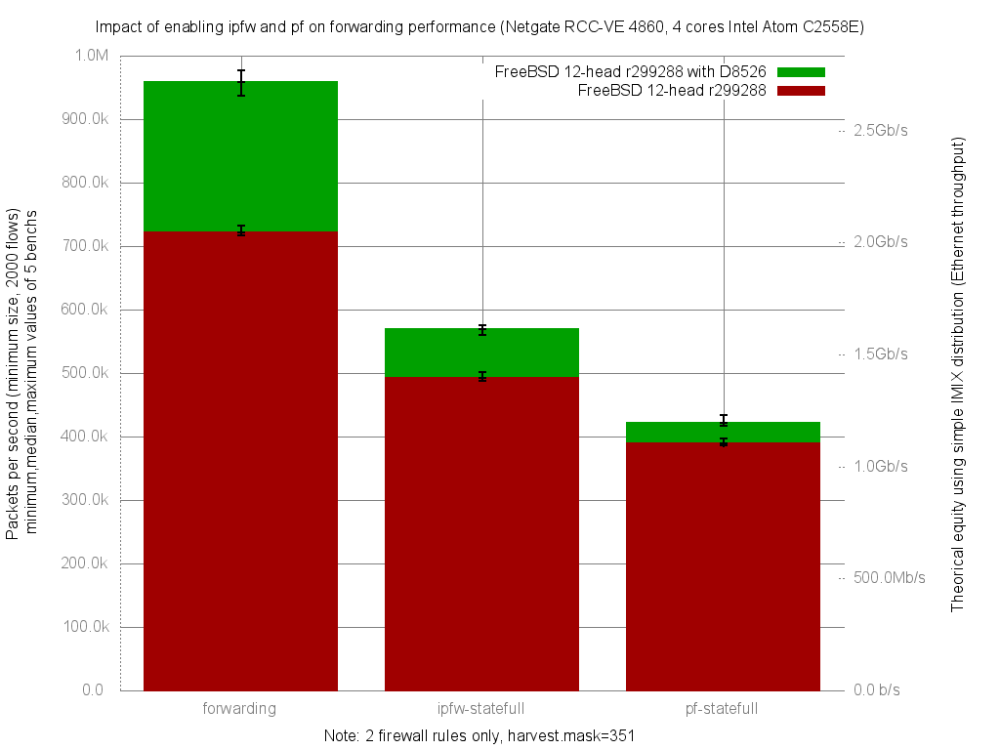

Impact of D8526 on ipfw,pf,forwarding performance
  - Netgate RCC-VE 4860 (4 cores Intel Atom C2558E)
  - Quad port Intel i350
  - FreeBSD 12-head r299288
  - 2000 flows of smallest UDP packets
  - Traffic load at 1.448Mpps (Gigabit line-rate)
  - harvest.mask=351



ministat status with forwarding improvement:

```
x 299288.forwarding.pps
+ 299288D8526.forwarding.pps
+--------------------------------------------------------------------------+
|xx                                                                   +    |
|xx xx                                                         +++ +++++  +|
||A_|                                                                      |
|                                                                |__A___|  |
+--------------------------------------------------------------------------+
    N           Min           Max        Median           Avg        Stddev
x  10        717198      731714.5        721286     722036.15     4737.6209
+  10        937015        977653     957997.25     956633.35     12195.338
Difference at 95.0% confidence
        234597 +/- 8692.44
        32.4911% +/- 1.26209%
        (Student's t, pooled s = 9251.25)
```

ministat status with ipfw improvement:

```
x 299288.ipfw-statefull.pps
+ 299288D8526.ipfw-statefull.pps
+--------------------------------------------------------------------------+
|x  xxx                                                                  + |
|x  xxxx     x                                               ++ +  ++++  ++|
| |__A__|                                                                  |
|                                                               |___AM___| |
+--------------------------------------------------------------------------+
    N           Min           Max        Median           Avg        Stddev
x  10      487672.5      501647.5      492726.5     492678.95     3997.3165
+  10        559993        575425     569253.25      568537.5     5525.1585
Difference at 95.0% confidence
        75858.5 +/- 4530.85
        15.3972% +/- 0.970619%
        (Student's t, pooled s = 4822.13)
```

ministat status with pf improvement:

```
x 299288.pf-statefull.pps
+ 299288D8526.pf-statefull.pps
+--------------------------------------------------------------------------+
|x x xxxx x x    x                              ++ ++++  ++   +           +|
| |___MA____|                                                              |
|                                               |_____M_A_______|          |
+--------------------------------------------------------------------------+
    N           Min           Max        Median           Avg        Stddev
x  10        385614        396466      389165.5     389702.05     3257.4917
+  10        417293        434312        420819      422305.7     5035.2254
Difference at 95.0% confidence
        32603.7 +/- 3984.41
        8.3663% +/- 1.04839%
        (Student's t, pooled s = 4240.56)

```
