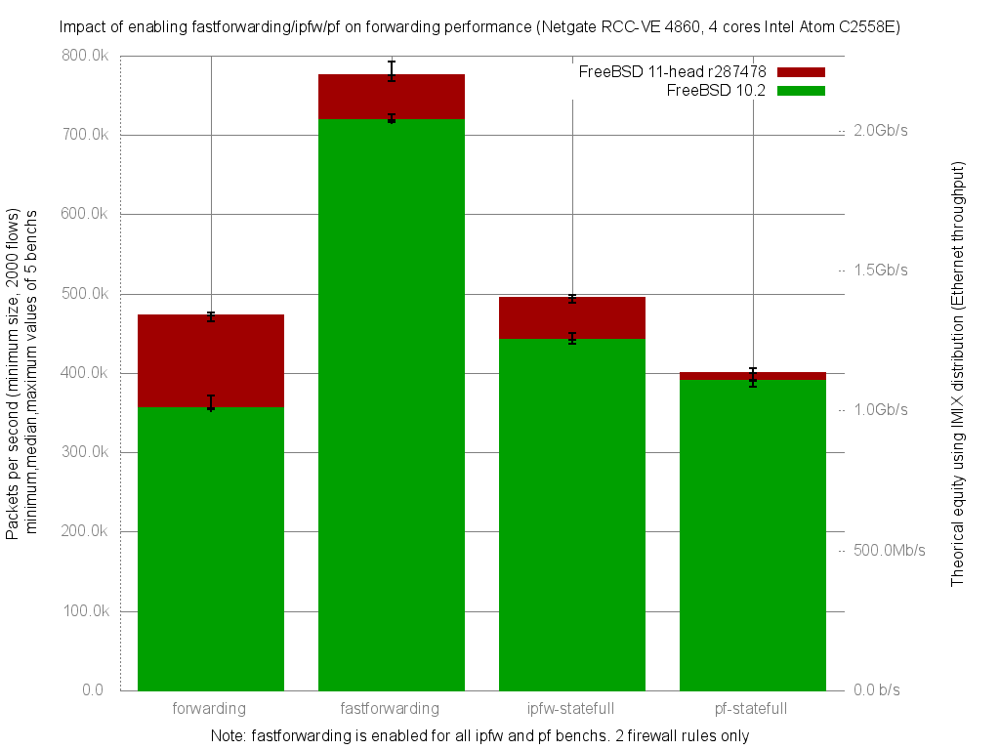

Impact of enabling fastforwarding/ipfw/pf on forwarding performance
  - Netgate RCC-VE 4860 (4 cores Intel Atom C2558E)
  - Quad port Intel i350
  - FreeBSD 11-head r287478
  - 2000 flows of smallest UDP packets
  - Traffic load at 1.448Mpps (Gigabit line-rate)




```
x pps.forwarding
+ pps.fastforwarding
* pps.ipfw-statefull
% pps.pf-statefull
+--------------------------------------------------------------------------+
| %                 *                                                      |
| %             x   *                                                     +|
|%% %         xxx  **                                                +++  +|
|              |A                                                          |
|                                                                    |_A__||
|                  |A                                                      |
||A|                                                                       |
+--------------------------------------------------------------------------+
    N           Min           Max        Median           Avg        Stddev
x   5        464827        476914        472662      471799.2     4657.5732
+   5        767573        792812        774876      778932.4     11876.258
Difference at 95.0% confidence
        307133 +/- 13155.9
        65.0983% +/- 2.78845%
        (Student's t, pooled s = 9020.49)
*   5        488135        497867        495257      494341.4     3752.0859
Difference at 95.0% confidence
        22542.2 +/- 6167.95
        4.77792% +/- 1.30732%
        (Student's t, pooled s = 4229.13)
%   5        391767        405606        399508      398328.8     5271.6474
Difference at 95.0% confidence
        -73470.4 +/- 7254.43
        -15.5724% +/- 1.53761%
        (Student's t, pooled s = 4974.1)
```
