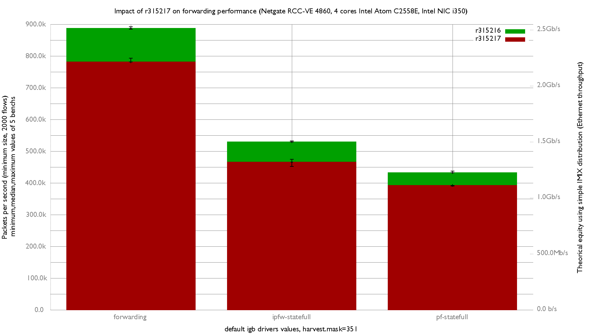

Impact of r315217 on forwarding performance
  - Netgate RCC-VE 4860 (4 cores Intel Atom C2558E)
  - Quad port Intel i350
  - FreeBSD 12-head
  - Default igb drivers tuning
  - harvest.mask=351
  - 2000 flows of smallest UDP packets
  - Traffic load at 1.448Mpps (Gigabit line-rate)



```
x r315216.forwarding, packets-per-second
+ r315217.forwarding, packets-per-second
+--------------------------------------------------------------------------+
| +                                                                        |
| +                                                                        |
| +  +    +                                                          xxxx x|
|                                                                    |_A_| |
||M_A___|                                                                  |
+--------------------------------------------------------------------------+
    N           Min           Max        Median           Avg        Stddev
x   5        884281        892567        887629      887931.6     3065.0416
+   5        780915        793435        781641      784582.2     5242.2284
Difference at 95.0% confidence
        -103349 +/- 6262.43
        -11.6393% +/- 0.685304%
        (Student's t, pooled s = 4293.92)
```

flame graph:
   - [r315216](bench.315216.svg)
   - [r315217](bench.315217.svg)
