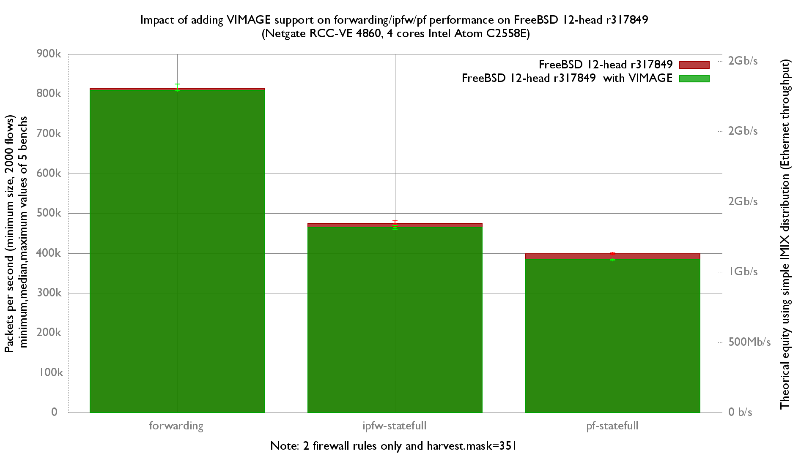

Impact of adding VIMAGE support on forwarding/ipfw/pf performance
  - Netgate RCC-VE 4860 (4 cores Intel Atom C2558E)
  - Quad port Intel i350
  - FreeBSD 11-stable r312663
  - 2000 flows of smallest UDP packets
  - 2 static routes
  - Traffic load at 14.88 Mpps




forwarding performance is not impacted:
```
x r317849 forwarding (packets-per-seconds)
+ r317849 with VIMAGE forwarding (packets-per-seconds)
+--------------------------------------------------------------------------+
|       +*  x  +                x      +                      x          +x|
|       |_______________________M_____A____________________________|       |
||_____________M_____________A___________________________|                 |
+--------------------------------------------------------------------------+
    N           Min           Max        Median           Avg        Stddev
x   5        807600        824480        813658        815069     7601.0168
+   5        807351        824252        809224      812758.4      7192.504
No difference proven at 95.0% confidence
```

ipfw performance decrease (-1.9%):

```
x r317849 ipfw-statefull (packets-per-seconds)
+ r317849 with VIMAGE ipfw-statefull (packets-per-seconds)
+--------------------------------------------------------------------------+
|+            + +        + x        +x               x      x             x|
|                              |__________________A__M_______________|     |
|    |__________M_A____________|                                           |
+--------------------------------------------------------------------------+
    N           Min           Max        Median           Avg        Stddev
x   5        467322        480745        474800      473965.6     5274.4672
+   5        460064        469853        464224      464914.6     3656.4819
Difference at 95.0% confidence
        -9051 +/- 6618.65
        -1.90963% +/- 1.37849%
        (Student's t, pooled s = 4538.16)
```

pf performance decreased (-3.7%):

```
x r317849 pf-statefull (packets-per-seconds)
+ r317849 with VIMAGE.pf-statefull (packets-per-seconds)
+--------------------------------------------------------------------------+
|   +                                                                      |
|+  +    + +                                                   xx xx      x|
|                                                             |___MA___|   |
| |_M_A___|                                                                |
+--------------------------------------------------------------------------+
    N           Min           Max        Median           Avg        Stddev
x   5        397919        400677        398812      398882.2     1079.4669
+   5        382698        385170        383552        383936      994.4315
Difference at 95.0% confidence
        -14946.2 +/- 1513.6
        -3.74702% +/- 0.371837%
        (Student's t, pooled s = 1037.82)
```

flame graph:
   - [r317849 and forwarding](bench.317849.forwarding.svg)
   - [r317849 and ipfw-statefull](bench.317849.ipfw-statefull.svg)
   - [r317849 and pf-statefull](bench.317849.pf-statefull.svg)
   - [r317849 with VIMAGE and forwarding](bench.317849VIMAGE.forwarding.svg)
   - [r317849 with VIMAGE and ipfw-statefull](bench.317849VIMAGE.ipfw-statefull.svg)
   - [r317849 with VIMAGE and pf-statefull](bench.317849VIMAGE.pf-statefull.svg)

They were generated with this command:
```
stackcollapse-pmc.pl bench.312905.1.pmc.graph | flamegraph.pl > bench.312905.svg

```
