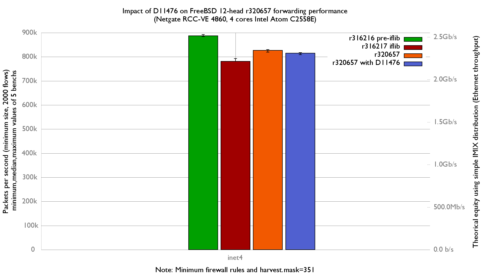

Impact of D11476 on forwarding performance
  - Netgate RCC-VE 4860 (4 cores Intel Atom C2558E)
  - Quad port Intel i350
  - FreeBSD 12-head r320657
  - LRO/TSO disabled
  - harvest.mask=351
  - 2000 flows of smallest UDP packets
  - Traffic load at 1.448Mpps (Gigabit line-rate)



inet4 forwarding: -1.41%

```
x r320657, inet4, packets-per-second
+ r320657 with D11476, inet4, packets-per-second
+--------------------------------------------------------------------------+
|+       +            +    +   +    x                        xx x         x|
|                                            |_____________A__M__________| |
|    |____________A___M________|                                           |
+--------------------------------------------------------------------------+
    N           Min           Max        Median           Avg        Stddev
x   5      819142.5      829855.5        826483        825722     3955.9076
+   5        809218        817676        815034        814025     3565.3156
Difference at 95.0% confidence
        -11697 +/- 5492.03
        -1.41658% +/- 0.659936%
        (Student's t, pooled s = 3765.68)

```

No impact on inet6 forwarding:
```
x r320657, inet6, packets-per-second
+ r320657 with D11476, inet6, packets-per-second

+--------------------------------------------------------------------------+
|                           +                                              |
|x            x    x     +  +     x           +  x                        +|
|    |_____________M___A__________________|                                |
|                  |________M___________A____________________|             |
+--------------------------------------------------------------------------+
    N           Min           Max        Median           Avg        Stddev
x   5        741769        759642        748553        750108      6917.188
+   5        750663        768919        751712        756294     7721.3557
No difference proven at 95.0% confidence

```

flame graph:
   - [r320657, inet4](bench.320657.inet4.1.pmc.svg)
   - [r320657, inet6](bench.320657.inet6.1.pmc.svg)
   - [r320657 with D11476, inet4](bench.320657D11476.inet4.1.pmc.svg)
   - [r320657 with D11476, inet6](bench.320657D11476.inet6.1.pmc.svg)
