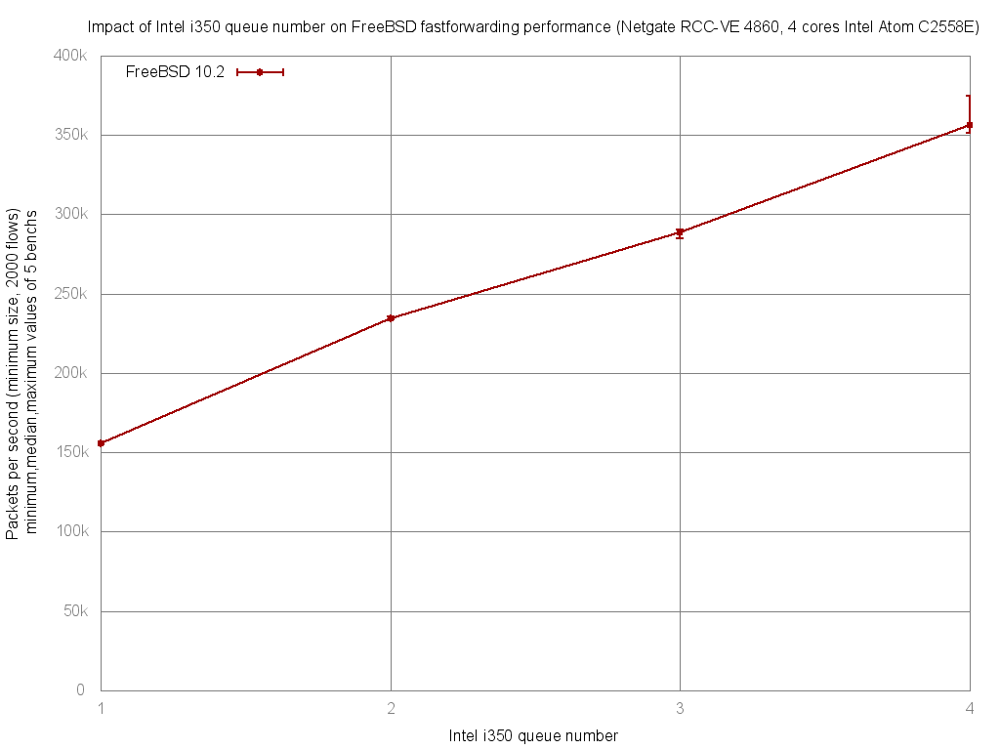

Impact of Intel i350 queue number on forwarding performance
  - Netgate RCC-VE 4860 (4 cores Intel Atom C2558E)
  - Quad port Intel i350
  - FreeBSD 10.2
  - 2000 flows of smallest UDP packets
  - Traffic load at 1.448Mpps (Gigabit line-rate)




```
x pps.1
+ pps.2
* pps.3
% pps.4
+------------------------------------------------------------------------+
|x                         +               * *                    %      |
|x                         +               ***                  %%%     %|
|A                                                                       |
|                          A                                             |
|                                          |A|                           |
|                                                               |_MA__|  |
+------------------------------------------------------------------------+
    N           Min           Max        Median           Avg        Stddev
x   5        154835        155686        155451      155372.6     343.00918
+   5        233925        235489        234477      234714.2      646.2621
Difference at 95.0% confidence
	79341.6 +/- 754.531
	51.0654% +/- 0.485627%
	(Student's t, pooled s = 517.354)
*   5        284649        290713        288718      287912.4     2935.0543
Difference at 95.0% confidence
	132540 +/- 3047.45
	85.3045% +/- 1.96138%
	(Student's t, pooled s = 2089.52)
%   5        351172        374604        356372      358294.8     9505.7277
Difference at 95.0% confidence
	202922 +/- 9809.4
	130.604% +/- 6.31347%
	(Student's t, pooled s = 6725.94)
```
