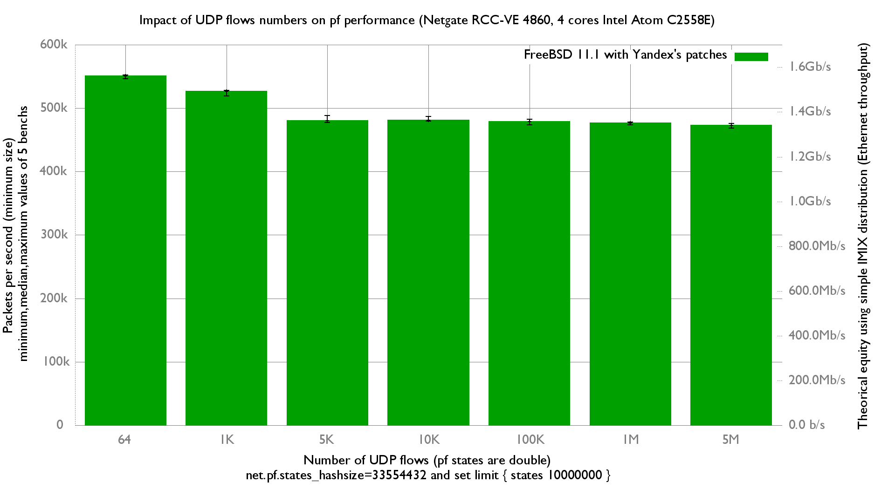

Impact of number of UDP flows on pf forwarding performance
  - Netgate RCC-VE 4860 (4 cores Intel Atom C2558E)
  - Quad port Intel i350
  - FreeBSD 11.1 with Yandex's patches (AFDATA and RADIX)
  - 5M unidirectional UDP flows of smallest UDP packets (create 10M pf states)
  - pf state limit increased to 10M, net.pf.states_hashsize="33554432"
  - Traffic load at 1.448Mpps (Gigabit line-rate)
  - harvest_mask="351"

