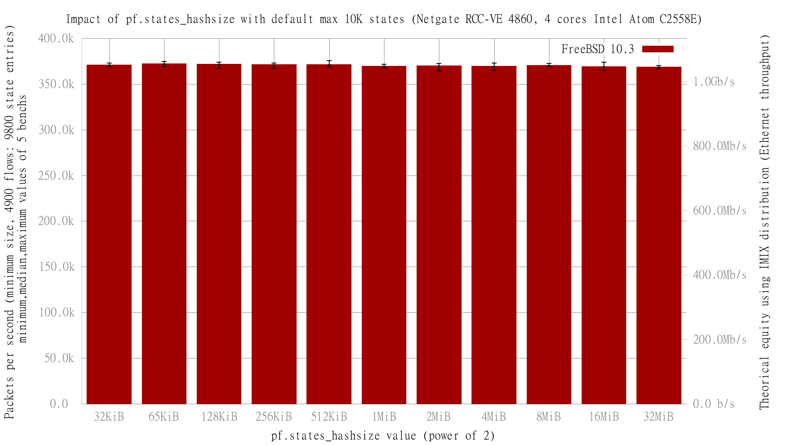

Impact of pf.states_hashsize with default max 10K states with FreeBSD 10.3
  - Netgate RCC-VE 4860 (4 cores Intel Atom C2558E)
  - Quad port Intel i350
  - FreeBSD 11-head r287478
  - 4900 unidirectionnal UDP flows (generate 9800 states) of smallest UDP packets until pf max default (10K)
  - Traffic load at 1.448Mpps (Gigabit line-rate)

