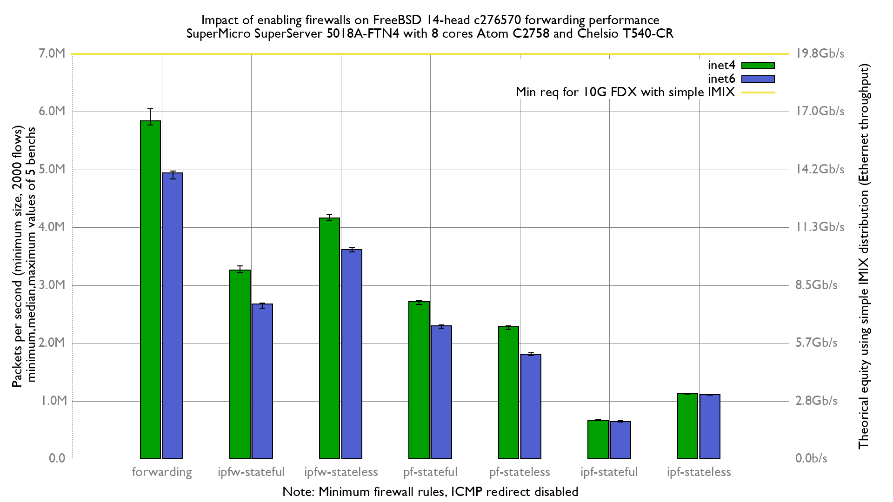

Impact of enabling firewalls on BSDRP 1.991 (FreeBSD 14 c276570) forwarding performance
  - SuperMicro SuperServer 5018A-FTN4 (8 cores Atom C2758 at 2.4GHz)
  - Quad port Chelsio 10-Gigabit T540-CR (10Giga DAC cable)
  - FreeBSD 14-head c276570
  - 2 static routes
  - harvest.mask=351
  - ICMP redirect disabled
  - 2000 UDP flows
  - Traffic load at 14.88 Mpps

